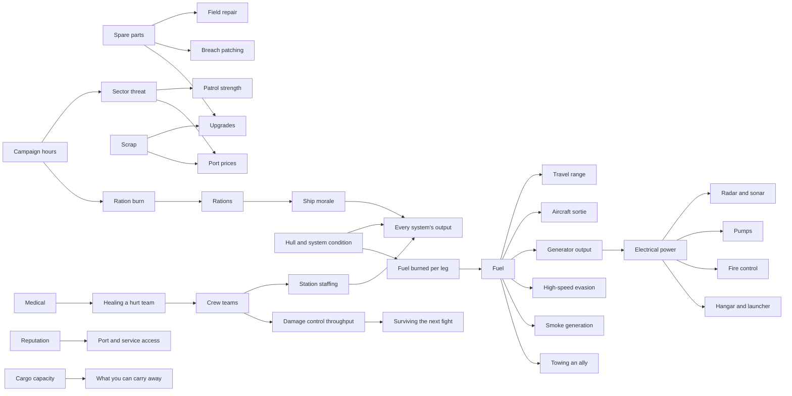

# Cause and effect

**Version:** 0.1
**Date:** September 12, 2026
**Source:** `../WW2_Naval_Roguelite_Game_Logic.md` v0.8, chiefly [§1.16:520](../WW2_Naval_Roguelite_Game_Logic.md).

The design document already demands this. Every consequential action must declare **requirements → immediate cost → execution time → intended effect → risks → persistent changes → recovery options** [§1.16:522]. What it does not supply is the wiring: which resource each cost lands in, and what that resource feeds, so that spending it visibly shuts a door somewhere else.

This file is that wiring. It is the reason a choice means something.

## Contents

1. [The test](#1-the-test)
2. [The resource graph](#2-the-resource-graph)
3. [What each resource closes](#3-what-each-resource-closes)
4. [The option contract](#4-the-option-contract)
5. [Rules that stop a consequence being fake](#5-rules-that-stop-a-consequence-being-fake)
6. [Eight events worked end to end](#6-eight-events-worked-end-to-end)
7. [Showing it to the player](#7-showing-it-to-the-player)
8. [How this gets checked](#8-how-this-gets-checked)

---

## 1. The test

**A consequence is real when you can name the specific future option it removes.**

"Morale drops" is not a consequence. It is a number moving.

"Morale at 64 puts the ship-wide output multiplier at 0.93, so every gun reloads 7% slower and every damage-control team works 7% slower until you spend four hours resting, which costs four rations and two threat points" is a consequence. It has a mechanism, a magnitude, a duration, and a price to undo.

Apply the test to every option in the catalog. If the answer is "the player feels bad about it", cut the option or wire it to something.

---

## 2. The resource graph

Arrows read "feeds". Spend anything upstream and everything downstream of it gets worse.



Three loops in there matter more than the rest.

**The fuel loop.** Damage raises the fuel burned per leg [§6.5:1434], which drains the same pool that pays for aircraft dispatch [§1.12:374] and generator output [§1.7:168]. A ship that takes a beating in sector three quietly loses its air wing in sector five, because dispatch fuel and travel fuel are one inventory.

**The time loop.** Hours feed threat at 2 points an hour [§6.5:1443] and burn rations at one unit per team per day [§1.10:321]. Rations run short, morale falls, and morale multiplies **every** system output between 0.85 and 1.10 [§6.5:1463]. Loitering is never free, and the cost arrives as a ship-wide performance penalty rather than a bill.

**The crew loop.** A detached team is a station nobody is standing at. Staffing enters system output directly as `clamp(effective_staff / required_staff, 0, 1)` [§6.5:1456], and damage-control work drops from 2.0 to 1.6 to 1.0 as teams leave the room [§1.8:220]. Sending men to do one thing always means not doing another.

---

## 3. What each resource closes

The lookup that drives every option in the catalog. When an option spends something in the left column, the writer picks the door from the right column.

| Spend this | And you have closed | Recover by |
|---|---|---|
| **Fuel** | A leg of route freedom, an aircraft sortie, generator headroom for radar and pumps, one high-speed evasion, or a tow you could have given | A port or tanker, economy speed, or a fuel find |
| **Electrical power** | A sensor, the pumps, fire control, or the hangar, shed in your saved priority order [§1.7:183] | Restore a generator, shed something else, or repair the plant |
| **Campaign hours** | Threat rises 2 points an hour; a ration day burns; the next threat threshold arrives sooner | Nothing recovers time. Only intelligence reduces threat [§6.5:1448] |
| **A crew team, detached** | That station's output falls to its unmanned fallback; damage control drops a tier | The team returns after its stated nodes, and walks back to its station |
| **A crew team, lost** | Permanent for the run. One fewer token everywhere | Rescue or recruit, if an eligible event or port appears |
| **Spare parts** | A field repair, a breach patch, or an upgrade you cannot now afford | Ports, salvage, mission rewards |
| **Medical** | A hurt team stays hurt, and works at its reduced health factor | Ports, rescue rewards |
| **Rations** | Endurance before the shortage clock starts and morale begins to slide | Ports, tenders, floating stores |
| **Morale** | Every system's output multiplier, ship-wide, bounded 0.85 to 1.10 | Rest, which costs hours and rations, or a positive event |
| **Hull or system condition** | Output through `condition_factor`, and fuel per leg rises | Field repair to the 70% ceiling; a port for the rest |
| **Threat** | Heavier patrols, worse interception odds, higher port prices; 25% carries into the next sector | Intelligence, a one-time objective, or a quiet route |
| **Reputation** | Access to a faction's ports, services and offers | Slowly, through choices that faction sees |
| **Scrap** | An upgrade, a repair, a recruit, or a replacement airframe | Encounter rewards, sales, jobs |
| **Cargo capacity** | Something already aboard goes over the side, and you choose what | Sell or deliver what is in the hold |
| **A flag set** | Opens or closes an authored branch two to five nodes out | Only by whatever that chain declares |

---

## 4. The option contract

Every option in every event fills all seven fields. Missing fields are how fake choices get written.

```yaml
option:
  id: turn_the_ship_back
  label: "Turn back and search"
  requires: {}                        # 1. requirements, the gate
  cost:                               # 2. immediate cost, in named resources
    fuel: 3
    campaign_hours: 1
  execution: {mode: campaign, hours: 1}   # 3. execution time
  effect:                             # 4. intended effect
    team_recovered: 0.75
  risk:                               # 5. risks
    team_lost: 0.25
    threat_from_loiter: 2
  closes:                             # 6. persistent change, named as a lost option
    - "one aircraft sortie this sector, if fuel does not reach a tender first"
    - "threat crosses 30 four hours sooner"
  recover:                            # 7. recovery options
    - "refuel at the sector-three tender"
    - "drop to economy speed for the next two legs"
```

**`closes` is the field that does the work.** It is prose, not a number, and it names an option the player would otherwise have had. The writer cannot fill it honestly without checking the graph in section 2. If `closes` reads "the player has less fuel", it is not finished.

---

## 5. Rules that stop a consequence being fake

Six failure modes and the rule that kills each.

**1. The refund.** A cost is spent when it is spent. The interface must not return it because the battle ended, the target escaped, or the outcome was bad. The design document states this directly at [§1.16:538]: fire one of two flares and you have one flare, whether or not help arrives.

**2. The compensating reward.** A bad outcome does not quietly hand back what it took. If an event costs you three fuel and gives nothing, that is a legitimate result. Padding every loss with a consolation prize teaches the player that choices do not matter.

**3. The invisible door.** The player must be able to see the cost before committing, and see the projected remaining stock [§1.16:536]. A consequence that only becomes knowable after the fact is a trap, not a decision. The exception is a declared hidden branch, which commits before it reveals and is authored that way on purpose.

**4. The debrief-only consequence.** If the only place a choice shows up is the end-of-run summary, it is flavour. A real consequence changes an available option somewhere in the remaining run. Either wire it or label it as flavour and stop calling it a consequence.

**5. The unrecoverable spiral.** Every consequence needs a recovery path, and that path costs something. The design document requires this at [§2.12:999]: cheaper stabilisation instead of full restoration, a finite repair opportunity, a lower-risk route, selling surplus. None of them is free and none of them resets you to full.

**6. The pure downside.** If an option has no reason anyone would pick it, it is not a choice, it is a punishment with a button. Every option needs something it is buying, even if that something is time, or a man's life, or the ability to sleep at night.

---

## 6. Eight events worked end to end

Each one shows the full chain. All 72 events now carry this treatment in [CATALOG-EVENTS.md](CATALOG-EVENTS.md); these eight are reproduced here as the reference for how the wiring is meant to read.

### EVT-30 — Man overboard during a high-speed turn

Shape: sacrifice. The example that started this file.

| Option | Spends | Closes | Recover by |
|---|---|---|---|
| **Turn back and search** | 3 fuel, 1 hour, +2 threat | One aircraft sortie later this sector, because dispatch draws on the same fuel inventory [§1.12:374]. Threat crosses its next threshold four hours sooner. | Refuel at a tender, or run economy speed for two legs |
| **Drop the sea boat** *(needs a sea boat)* | 1 team detached for 2 nodes, 2 hours | That team's station runs unmanned, so its system falls to its equipment fallback. Damage control drops from 2.0 to 1.6 if a fire starts before they are back. | The team returns after two nodes and walks back to station |
| **Mark the position and press on** | Nothing material. 6 morale. Sets `left_a_man` | Morale 64 puts the ship-wide multiplier near 0.93, so every gun and every repair runs 7% slower until you rest. Chain CHN-04 lowers the morale floor for the rest of the run. | A burial service at a later quiet node, which costs an hour |

The player is choosing between fuel, a station, and the crew's performance. All three are real currencies and all three are spent elsewhere.

### EVT-28 — Survivors in fuel oil, air threat inbound

Shape: sacrifice.

| Option | Spends | Closes | Recover by |
|---|---|---|---|
| **Stop and recover them** | 2 hours stopped, 0 fuel | A stopped ship has no evasion term. The inbound raid attacks a stationary target, so incoming damage lands at the full rate with no speed reduction. | AA fire, smoke if fitted, damage control after |
| **Recover at slow speed** | 3 hours, 4 fuel, some survivors lost | Fewer survivors means fewer passenger slots used, which sounds like a saving until the port that pays for them counts heads. | Nothing. The men are gone |
| **Clear the area** | Nothing, 8 morale, reputation with that faction | That faction's ports price you higher and one service tier closes. Morale hit runs ship-wide. | Reputation recovers slowly through later choices |

### EVT-46 — A boiler tube lets go

Shape: known trade. The clearest example of the fuel loop.

| Option | Spends | Closes | Recover by |
|---|---|---|---|
| **Repair now** *(needs parts ≥ 3)* | 3 parts, 3 hours | Those parts are not available to patch a breach in the next fight, and damage control without parts can contain but not repair [§1.10:299]. | Buy parts at the next port, or salvage them |
| **Run on reduced power** | Nothing now | Condition drops, and condition raises fuel burned per leg [§6.5:1434]. Every remaining leg costs more, so this is a loan against your fuel. Speed drops, so evasion drops, so you take more damage, which costs more condition. | A port overhaul. Field repair only reaches 70% [§1.9:283] |
| **Shut down and drift while repairing** | 5 hours, +10 threat | A drifting ship at raised threat is a strong interception candidate on departure. | Nothing. You took the exposure |

The second option is deliberately the spiral. It is cheap now and it compounds, which is exactly the shape the design document calls a failure spiral and requires to stay recoverable at [§2.12:999].

### EVT-49 — A shell in the magazine that did not go off

Shape: sacrifice.

| Option | Spends | Closes | Recover by |
|---|---|---|---|
| **Send a team to remove it** | 1 team at risk, 1 hour | If the team is lost, that is one of six gone for the run, permanently. Damage control caps lower for every remaining fire. | Rescue or recruit a replacement team if an eligible event appears |
| **Flood the magazine** | That magazine's ammunition, plus flooding to pump out | You lose the shells for that battery. A gun with no ammunition has zero useful output no matter how good it is [§2.12:933]. | Buy ammunition at the next port, if it stocks that class |
| **Leave it and post a sentry** | 1 team assigned, ongoing | That team is out of the damage-control pool for the rest of the encounter. | Remove it after the fight, at the same risk |

### EVT-72 — An aircraft shadowing at the edge of range

Shape: hidden branch.

| Option | Spends | Closes | Recover by |
|---|---|---|---|
| **Ignore it** | Nothing | Chain CHN-01 fires in two nodes: a strike arrives with your position already known, which means no warning time and no chance to disperse. | AA, smoke, or accepting the damage |
| **Fire at extreme range** *(needs AA tier 2)* | AA ammunition, +3 threat from the noise | Spent AA is AA you do not have for the raid it was going to call anyway. Probably drives it off. | Restock AA at a port |
| **Alter course away** | 4 fuel, 2 hours, one route layer of progress | Fuel and hours both. You may break contact and you may not. | Nothing. It either worked or it did not |

### EVT-41 — A prize worth taking

Shape: sacrifice. The clearest crew-loop example.

| Option | Spends | Closes | Recover by |
|---|---|---|---|
| **Put a prize crew aboard** *(needs a spare team)* | 1 team, gone for 2 to 4 nodes or forever | Six teams becomes five. Every room's damage-control ceiling drops, and one station stays unmanned until they return. Chain CHN-06 decides whether they come back. | They return with a reward, or they do not |
| **Sink her** | Shells or one torpedo, 1 hour | A torpedo spent here is a torpedo not available for the cruiser in sector five, and torpedoes do not restock at every port. | Resupply at a torpedo-capable port |
| **Leave her** | Nothing | She is salvaged by the other side and appears later as a reinforcement in a sector-five encounter. | Nothing |

### EVT-23 — An abandoned depot, three lots, room for one

Shape: capacity.

| Option | Spends | Closes | Recover by |
|---|---|---|---|
| **Take the fuel** | Cargo space, 1 hour | You did not take the parts, so the next breach is patched with what you already had, or not at all. | The other two lots are gone for the run |
| **Take the parts** | Cargo space, 1 hour | You did not take the fuel, so the next long leg runs on a thinner margin and a detour is off the table. | As above |
| **Take the ammunition** | Cargo space, 1 hour | You did not take either, and you still have to reach the next port on current fuel. | As above |

No option here is a trap. All three are good. The consequence is purely what you gave up, which is the cleanest kind.

### EVT-14 — Quiet water

Shape: two goods. Proof that a good event still costs.

| Option | Spends | Closes | Recover by |
|---|---|---|---|
| **Rest the crew** | 4 hours, 4 rations, +8 threat | Four hours of threat accrual, and four rations closer to the shortage clock. Morale rises toward 70, which raises every system's output. | Restock rations at a port |
| **Run drills** | 3 hours, 3 rations, +6 threat | One team's task rate improves for the run. The hours and rations are still spent. | Nothing needed |
| **Press on** | Nothing | You arrive at the next node with the morale you had. If that morale is 64, everything still runs at 0.93. | A later quiet node, if the generator gives you one |

Reading the scene grants nothing. That is already the rule at [§1.14:482].

---

## 7. Showing it to the player

A consequence the player cannot see before choosing is a trap. Three surfaces carry it.

**Before the choice.** Each option shows its guaranteed cost, its known risk, and the projected remaining stock of whatever it spends [§1.16:536]. Not the whole downstream chain, which would be unreadable, but the resource and the number. "Turn back: 3 fuel, 1 hour. Fuel after: 41." The player who knows fuel flies aircraft draws the rest themselves, and the player who does not learns it the first time a sortie is refused.

**At the moment it bites.** When an option is unavailable, the interface names the reason in the same vocabulary. "Launch strike: not enough fuel (needs 12, have 7)." This is the single most important line in the game for teaching cause and effect, because it closes the loop between a choice made an hour ago and a door shut now.

**In the debrief.** The cause-and-effect timeline at [§4.6:1238] replays the chain. The design document's own example: heavy volley, generator lost, pump output fell, teams left the guns to patch flooding, ammunition remained but offensive uptime collapsed. That is four links, each one traceable to a mechanism.

**The action log** keeps to observable evidence [§1.16:536]. It can report that you transmitted and that a pursuit later appeared, without revealing at the time that a submarine heard you.

---

## 8. How this gets checked

`scripts/check-consequences.py` reads the catalog and fails any option that does not carry the contract. It checks:

- Every event has at least two options.
- Every event has at least one option with no gate, so a baseline starter always has an answer [§5.3:1285].
- Every option names what it spends, and every named resource exists in the section 3 table.
- Every option names what it closes, and that text is not merely a restatement of what it spends.
- Every option that closes something names a recovery, or says plainly that there is none.
- Every chain referenced by an event exists in Catalog C.

Run it before committing catalog changes, the same way `verify.py` guards the research:

```bash
python3 scripts/check-consequences.py
```

---

*The seven-part contract is the design document's, at [§1.16:522]. The resource graph, the closure table, the six failure modes, and the worked examples are new here.*
