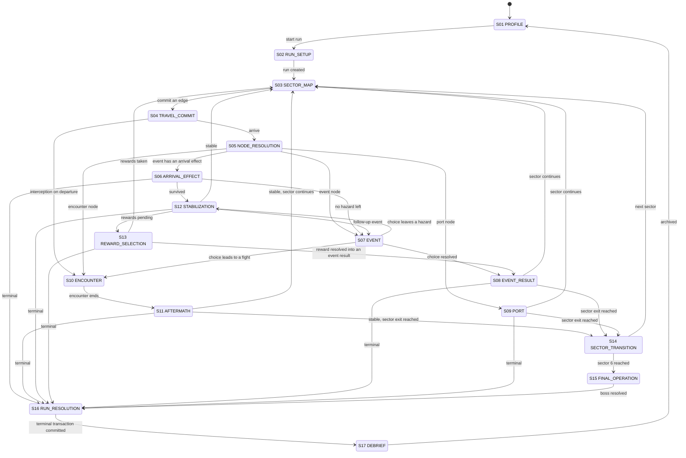
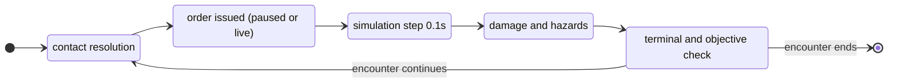

# Game flow and possibility tree

**Version:** 0.1 — first complete pass
**Date:** September 12, 2026
**Source:** `../WW2_Naval_Roguelite_Game_Logic.md` v0.8. Every branch below cites the line that defines it.

This document is the state machine of the game and the space of things that can happen inside it. The design document says what the rules are. This says what the shapes are: which state the game is in, what the player can do from there, what each choice can produce, and where control goes next.

Nothing here is invented. A branch either cites a design-document line or carries an `OPEN` marker meaning the document does not define it yet. Section 16 collects every `OPEN` in one list. That list is the work remaining before anyone writes game logic.

## How to read this

| Symbol | Meaning |
|---|---|
| `S01` … `S17` | A state. The game is in exactly one at a time. |
| `→` | A transition. The label on it is the condition that fires it. |
| **Choice** | The player decides. The game waits. |
| **Roll** | The generator or simulation decides, from a committed random stream. |
| **Check** | A rule decides from current state. No randomness, no player input. |
| `OPEN-nn` | The design document does not specify this branch. See section 16. |
| `[§x.y:NNN]` | Line NNN of `WW2_Naval_Roguelite_Game_Logic.md`. |

Two clocks run in this game and they never overlap. The campaign clock advances in **hours**, only when the player commits an action [§1.4:102]. The tactical clock advances in **0.1-second fixed steps** and only inside an encounter [§1.4:104]. Combat converts to campaign time exactly once, as `combat_hours = simulated_seconds / 3600` [§1.4:104]. No state may charge both.

## Contents

1. [Master state machine](#1-master-state-machine)
2. [S01 PROFILE](#2-s01-profile)
3. [S02 RUN_SETUP](#3-s02-run_setup)
4. [S03 SECTOR_MAP](#4-s03-sector_map)
5. [S04 TRAVEL_COMMIT](#5-s04-travel_commit)
6. [S05 NODE_RESOLUTION](#6-s05-node_resolution)
7. [S06 ARRIVAL_EFFECT](#7-s06-arrival_effect)
8. [S07 EVENT and S08 EVENT_RESULT](#8-s07-event-and-s08-event_result)
9. [S09 PORT](#9-s09-port)
10. [S10 ENCOUNTER](#10-s10-encounter)
11. [S11 AFTERMATH and S12 STABILIZATION](#11-s11-aftermath-and-s12-stabilization)
12. [S13 REWARD_SELECTION](#12-s13-reward_selection)
13. [S14 SECTOR_TRANSITION](#13-s14-sector_transition)
14. [S15 FINAL_OPERATION](#14-s15-final_operation)
15. [S16 RUN_RESOLUTION and S17 DEBRIEF](#15-s16-run_resolution-and-s17-debrief)
16. [Open branches](#16-open-branches)
17. [Where the repo contradicts itself](#17-where-the-repo-contradicts-itself)

---

## 1. Master state machine

Transcribed from the state block at [§1.4:108].



**Run lifecycle, running underneath all of it** [§3.5:1150]:

```
ACTIVE → TERMINAL_PENDING → ARCHIVED
```

Monotonic. A run never returns to `ACTIVE`. `TERMINAL_PENDING` exists so a crash between "the run ended" and "the profile recorded it" resolves once on reopen, granting nothing twice and reviving nothing [§3.5:1155].

**Terminal checks** run after each completed atomic campaign action and each completed tactical step capable of changing survival or objectives [§1.4:124]. Never mid-step. Resolve the step's damage and objective facts together, then apply the precedence rules at [§4.5].

---

## 2. S01 PROFILE

The only state that survives between runs.

**Holds** [§3.2:1103]: profile ID, settings, accessibility preferences, discovered codex entries, unlocked starting options, challenge progress, run history, processed reward and terminal transaction IDs.

**Choices**

| ID | Choice | Leads to |
|---|---|---|
| P-1 | Start a new run | S02 |
| P-2 | Read an archived debrief | S17 (read-only, no resume) |
| P-3 | Change settings or accessibility | S01. Changes no gameplay randomness [§3.7:1179]. |

**Rules that bind this state**

- Current-run fuel, crew, equipment, Scrap, and mission cargo never become profile inventory [§3.2:1113].
- Unlocks are horizontal. They add alternatives: extra destroyer layouts, doctrines, equipment packages, campaigns, challenge rules, codex entries. Persistent numeric hull, damage, or resource bonuses are excluded [§2.7:740].
- All four factions have a baseline starting option from the first run. No faction is gated behind another faction's completion [§2.7:740].
- A completed or lost run cannot be resumed as an active campaign [§3.1:1095].

`OPEN-01`: the exact unlock predicates. The document says "explicit achievement predicates" and gives three examples [§2.7:742], and registers the decision as META-01 [§6.11:1770].

---

## 3. S02 RUN_SETUP

**Choice sequence** [§2.1:663]

| Step | Choice | Options | Source |
|---|---|---|---|
| 1 | Side | Allies, Axis | [§1.1:41] |
| 2 | Faction | Allies: American, British. Axis: German, Japanese. | [§1.1:43] |
| 3 | Ship design / layout | That faction's roster. Baseline always available. | [§1.1:50] |
| 4 | Difficulty | `OPEN-02` | [§2.1:663] |
| 5 | Starting loadout | Trades among fuel endurance, ammunition, sensors, protection, common-area capacity, support. Cannot exceed slot, weight, electrical, or cargo limits. | [§2.1:667] |
| 6 | Seed | Random or user-entered | [§2.1:663] |

**Shown before commit** [§2.1:663]: the final boss objective, the ship's actual strengths and weaknesses, starting supply endurance.

**Committed at creation** [§3.2:1104]: run ID, profile ID, side, faction, ship layout, campaign ruleset, **preselected boss archetype**, initial seed, generation/save/content versions, immutable balance configuration hash, difficulty, starting choices, eligible content manifest.

The boss archetype is chosen here, not at sector 6. Later player upgrades cannot cause the game to substitute a harder counter [§4.1:1194].

**Generation runs now, in this order** [§5.2:1272]:

1. Fix faction, layout, force pools, boss objective and archetype, ruleset, difficulty, seed, eligible starting content.
2. Generate the sector structure and forward route graph.
3. Place mandatory objectives, exits, baseline services, known capability gates.
4. Construct at least one baseline-feasible route using guaranteed resources and a documented reserve assumption.
5. Allocate each encounter a threat budget and select compatible templates.
6. Populate optional hazards, rewards, events, shops, weather, limited follow-up chains.
7. Validate connectivity, prerequisites, resource availability, objective capacity, encounter counterplay.
8. Retry invalid generation deterministically up to a fixed attempt limit; fall back to a known-valid graph.
9. Persist the graph and committed content. Reveal only what reconnaissance permits.

**Starting state, prototype** [§2.1:665]: one destroyer, six selectable teams, modest parts and medical supplies, fuel for the sector's baseline route plus a displayed safety margin.

**Exits:** S03 only.

`OPEN-02`: difficulty levels are referenced repeatedly but never enumerated. The document says difficulty may alter starting reserves, threat growth, enemy coordination, warning lead time, and reward abundance [§5.6:1330], without naming the settings.
`OPEN-03`: how many hulls per faction. Registered as SCOPE-01 [§6.11:1756].
`OPEN-04`: no ship layout exists. No compartment graph, no deck positions, no station list, for any hull. Listed as the first TBD at [§6.12:1801] and named as the next design step at [§6.12:1816].

---

## 4. S03 SECTOR_MAP

**Time does not advance here.** Reading, planning, inspecting the ship, and leaving a menu open cost nothing [§1.4:102]. Map idling and pause do not raise threat [§1.6:153].

**Structure** [§1.5:128]

```
sector := entry → layer₁ → layer₂ → … → layerₙ → exit      where n ∈ [4, 6]
layer  := choice of 2 to 4 alternative nodes
```

The player visits **one node per layer**. Clearing every node is not possible and not required.

**Node types** [§1.5:130]

Open-water waypoint, island, strait, convoy rendezvous, patrol lane, salvage site, weather front, minefield, port, anchorage, distress call, operation area.

Geography and event identity are separate. An island approach can hold a patrol, aircraft, mines, a service opportunity, or quiet passage [§1.5:130].

**Shown per edge before commit** [§1.5:134]: distance, normal fuel cost, campaign hours, convoy compatibility, known weather, known threat. Uncertain modifiers appear as a range or a labeled hazard category, never as false precision [§1.5:130].

**Choices**

| ID | Choice | Cost | Leads to |
|---|---|---|---|
| M-1 | Inspect a node or edge | none | S03 |
| M-2 | Inspect the ship, crew, cargo, log | none | S03 |
| M-3 | Set speed mode: economy, cruise, flank | none until commit | S03 |
| M-4 | Commit an edge | fuel + hours, atomic | S04 |
| M-5 | Suspend the run | none, no time passes | S01 |

**Speed mode** [§2.12:953]

| Mode | Speed vs cruise | Fuel per distance | Time for same distance |
|---|---:|---:|---:|
| Economy | 0.80 | 0.85 | 1.25 |
| Cruise | 1.00 | 1.00 | 1.00 |
| Flank | 1.25 | 1.60 | 0.80 |

**Edge selectability check** [§1.5:137]: an edge is selectable only when its normal cost is affordable, unless it explicitly offers a risky emergency alternative. No negative fuel, no hidden borrowing.

**Threat display** [§1.6:151]: `sector_threat` runs 0 to 100 with thresholds at 30, 60, 85. The route preview explains the current consequences. Crossing a threshold applies its effects after the action that crossed it, visible before the next commitment [§1.6:157].

`OPEN-05`: what concretely changes at threat 30, 60, and 85. The document says patrol composition, interception probability, and port service costs change [§1.6:151], without giving the deltas.
`OPEN-06`: no sector graph has ever been authored. Listed as TBD at [§6.12:1805].

---

## 5. S04 TRAVEL_COMMIT

One atomic transaction [§1.5:135].

**Sequence**

1. **Check** prerequisites and affordability.
2. **Commit** normal fuel and time together. Any event surcharge is a separate disclosed consequence with a stated outcome if unaffordable [§1.5:135].
3. **Save** a durable generation before revealing anything [§3.3:1121].
4. **Roll** threat update [§6.5:1455]:
   `threat_after = clamp(threat_before + 2 × elapsed_hours + action_signature_points − committed_intelligence_reduction, 0, 100)`
   Signature impulses are applied once per committed action ID. Prototype: 3 points for a conspicuous departure, 4 for a loud engagement.
5. **Check** interception.

**Travel cost** [§6.5:1444]

```
travel_hours       = edge_distance / effective_transit_speed
vessel_travel_fuel = edge_distance × fuel_per_distance × speed_multiplier
                     × weather_multiplier × damage_multiplier
```

`effective_transit_speed` is the destroyer's own eligible speed, or the slowest required accompanying vessel when traveling as a force [§6.5:1450].

**Branches**

| ID | Condition | Leads to |
|---|---|---|
| T-1 | Normal arrival | S05 |
| T-2 | Departure triggers one interception | S10, then back to the interrupted transit |
| T-3 | Transit interrupted | Destination and remaining travel are remembered [§1.5:136] |

**Hard limits**

- Committed travel cannot be canceled to reroll an arrival [§1.5:136].
- A departure may trigger **at most one** additional interception, and that interception cannot recursively trigger another [§1.6:154].
- Threat cannot spawn unlimited farmable enemies at one node [§1.6:155].

---

## 6. S05 NODE_RESOLUTION

The node picks exactly one primary event instance and its permitted follow-ups [§1.14:439].

**Sequence** [§1.14:441]

1. Commit arrival: resolve travel once, select the eligible event and its initial random values, save the arrival record.
2. Branch on what that event is.

**Event family selection** [§5.4:1306]

First select an eligible primary family, then a template within it. Prototype relative weights, before eligibility filters:

| Family | Weight | Typical destination |
|---|---:|---|
| Combat | 35 | S10 |
| Supply / equipment discovery | 20 | S07 |
| Decision / barter | 15 | S07 |
| Rescue | 10 | S07 |
| Hazard / emergency | 10 | S06 |
| Quiet passage | 10 | S07 |

They total 100 **before** exclusions. They are relative weights, not promised percentages [§5.4:1306]. Fixed tutorial, service, and boss nodes use declared content instead. A family with no eligible templates contributes zero weight; normalize the rest or use a known-valid quiet fallback [§5.4:1308].

**Weighting formula** [§6.5:1525]

```
weight(event) = base_weight × sector_fit × context_fit × novelty_factor
p(event)      = weight(event) / sum(weight of all eligible events)
```

Ineligible events weigh zero. An empty pool selects a known-valid fallback and never divides by zero.

**Repetition control** [§5.4:1308]: per-run cooldowns, unique-event flags, category quotas, configurable limits on consecutive forced combat and repeated unrewarding events. Selection commits on arrival, so cycling pause, shop tabs, or a reload cannot reroll the category, the find, or the team.

**Branches**

| ID | Condition | Leads to |
|---|---|---|
| N-1 | Event declares an arrival effect | S06 |
| N-2 | Event is a discovery, decision, rescue, or quiet passage | S07 |
| N-3 | Node is a port | S09 |
| N-4 | Event is combat, or the node is an operation area | S10 |

---

## 7. S06 ARRIVAL_EFFECT

The state that exists because the player asked for the first problem to have already happened when control returns.

**Sequence** [§1.14:442]

1. Apply the effect **once**, as part of the arrival transaction.
2. Evaluate terminal conditions.
3. If alive: present the scene **paused**. The player gets control before floodwater, fire, or any second hazard advances. No text-reading period secretly consumes team health [§1.14:443].

**Prototype effect, EVT-01 unseen mine** [§1.14:455]: one detonation for 5 to 10 percent of maximum hull, one modest breach in an accessible compartment, mine resolved to `detonated`, then pause.

**Bounding rules** [§1.14:457]

- A healthy starter with baseline tools must have a workable response.
- Do not also remove all teams, disable every pump, and add an unannounced air raid in the same arrival package.
- A critically damaged ship can still sink from the first hit. No secret clamp to one hull point.
- Unchosen arrival-damage events carry a cooldown of **three subsequently visited locations** [§1.14:459]. Changing screens does not advance it. Test the cooldown before selecting a later node's event, and decrement it after resolving that node. The node that created the cooldown does not consume its own first protected visit [§1.14:461].

**Branches**

| ID | Condition | Leads to |
|---|---|---|
| A-1 | Survived, hazards active | S12 |
| A-2 | Survived, no hazard remains | S07 |
| A-3 | Terminal | S16 |

**Resume rule** [§3.3:1133]: an arrival commitment may hold an unapplied mandatory effect. On resume, complete it before returning control. Persist the damage, the breach, the mine's spent state, and the applied-effect ID together. A later resume neither skips the explosion nor applies it twice.

---

## 8. S07 EVENT and S08 EVENT_RESULT

**Event lifecycle** [§1.14:441], steps 3 through 7:

3. Present the scene paused.
4. Choose or stabilize. Emergencies use the normal team and room controls. Discovery choices show guaranteed costs, known risks, and eligible special options.
5. Commit chosen outcomes. Spend costs, save any random result that becomes known, resolve work or a follow-up encounter under its declared clock.
6. Allocate rewards, only after the reward is secured. Resolve capacity conflicts explicitly.
7. Close the event. Persist completion, losses, unclaimed and forfeited items, cooldowns, and follow-up flags before returning to the map.

**Reward types and their capacity rules** [§1.14:490]: Scrap balance, physical supplies, equipment, owned aircraft, recruitable team, passenger group, information. Each has its own capacity and eligibility rule. Generic accept-reward logic that silently exceeds seven teams, creates hangar space, or installs a gun in an occupied position is forbidden.

### The fourteen authored events

Every one of these is a one-line table row in the design document. None has costs, odds, or reward amounts. Sources: [§1.14:469] through [§1.14:482]. `OPEN-07` covers all fourteen manifests.

| ID | Arrival | Player choices | Outcome space | Persistent consequence |
|---|---|---|---|---|
| EVT-01 | Unseen mine | Immediate bounded blast and one breach; pause; assign repair teams | Hull, parts, and time cost. No guaranteed compensation. | One spent mine ID. The remaining field becomes a navigable encounter, not repeated arrival damage. |
| EVT-02 | Floating ration cases | Recover quickly, inspect first, pass | Typed rations, with a declared chance of spoiled or damaged contents | Only accepted usable units enter stock. Inspection costs time. Full storage forces a partial-pickup choice. |
| EVT-03 | Ammunition on a cargo raft | Inspect, recover, leave | Compatible shells or charges, or a salvage-value item | Unknown or unusable rounds never become free compatible ammunition. |
| EVT-04 | Raft with a surviving team | Rescue, carry as passengers, signal help, pass | A new active team if capacity and eligibility allow | Identity, health, skill, and recovery state are fixed at rescue. Full roster follows [§2.5:721]. |
| EVT-05 | Civilian survivor raft | Recover noncombatants, relay their position, pass | Morale, a later port reward, or information when offered | Survivors consume declared accommodation and rations. They never auto-become a combat team. |
| EVT-06 | Abandoned supply launch | Fuel transfer, parts recovery, or a limited combined task | Fuel, parts, or Scrap from separate stock pools | Interrupted transfer keeps delivered portions. The source depletes once and never refreshes. |
| EVT-07 | Adrift weapon assembly | Salvage the mount, or strip it for Scrap | Stored equipment **or** its declared salvage value, never both | No automatic combat installation. Full storage can favor stripping. |
| EVT-08 | Fouled propeller | Detach a team to repair, or limp onward | Time and parts, or a temporary speed and fuel penalty | The fault persists until repaired. Reopening the map does not reset it. |
| EVT-09 | Storm cargo shift | Secure the stores, reroute, or press on if offered | Delay, limited damaged stores, or flood-control work | Loss draws from actual eligible stock. Empty magazines cannot go negative. |
| EVT-10 | Merchant barter | Accept or decline a finite exchange | A trade that is not always better than port prices | Both sides' stock and prices save. Repeated dialogue cannot regenerate the offer. |
| EVT-11 | Distress signal, uncertain origin | Observe, scout, approach, ignore | Help, information, supplies, or a fight | The hidden branch commits **before** it is revealed. Reloading cannot turn an ambush into a rescue. |
| EVT-12 | Wreck chart or dispatch pouch | Spend time recovering information | Reveals a port, a hazard, or a later route option. Optional Scrap if listed. | Reveals an existing compatible node or flag. Never generates an unreachable mandatory quest. |
| EVT-13 | Friendly repair party | Accept limited field service, exchange parts, decline | A capped patch or system repair, or a port referral | Real capacity and cost. No free full hull restoration on repeat interaction. |
| EVT-14 | Quiet water | Move on, or take a declared rest or reorganization action | Breathing room, optional morale recovery | Reading the scene grants no free healing, food, or fuel. Chosen rest still costs time and rations. |

**Branches out of S07**

| ID | Condition | Leads to |
|---|---|---|
| E-1 | Choice resolved, nothing left running | S08 |
| E-2 | Choice leads to a fight, including EVT-11's ambush branch | S10 |
| E-3 | Choice leaves an active hazard | S12 |

**Branches out of S08**

| ID | Condition | Leads to |
|---|---|---|
| R-1 | Sector continues | S03 |
| R-2 | Node was the sector exit | S14 |
| R-3 | Terminal | S16 |

**Anti-softlock guarantee** [§5.3:1297]: at least one eligible option or explicit terminal decision exists in every event state. Missing crew, destroyed equipment, or full storage cannot trap the interface. No random event may offer only a disabled button.

---

## 9. S09 PORT

**Time does not advance during shopping.** Equipment selection, inspection, and cart changes are previews. Committed services advance time [§1.5:143].

**Port flow** [§2.11:843]

1. Enter a valid service berth, or finish a declared arrival emergency first. Normal ports do not roll an unrelated hidden mine hit while the shop is open.
2. Generate and save this port instance's stock, offers, service limits, and quotes. Reopening tabs changes none of them.
3. Inspect, buy, compare, plan a refit, sell surplus, arrange a roster exchange. Cart edits are previews only.
4. Show net Scrap change, old and new equipment or team, remaining supplies and capacities, installation time, power and staffing impact, any loss of capability.
5. Confirm the transaction. Reserve and debit stock and payment together with the saved work state. Apply delivery only at its declared completion boundary.
6. Resolve time, automatic rations, and threat once.
7. Leave. Stock and completed services stay depleted. Departing never restocks, heals, or refunds.

**Service types** [§2.11:839]: replenishment stop, equipment trader, repair yard, recruitment office, aviation-capable service. One port may combine them. Visible icons distinguish them. A guaranteed baseline port supplies the essentials that generation assumes.

**What can change, and where** [§2.11:855]

| Action | Allowed location | What stays fixed |
|---|---|---|
| Reassign teams, change power, targets, ammunition, sortie roles | Any eligible planning or tactical state | Travel and setup time, committed costs, compatibility |
| Repair a system, patch a breach | Eligible compartment at sea, or a service facility | Field-repair ceiling of 70% [§1.9:283] |
| Buy a weapon or module | Stocked port | Item identity, variant, tier, condition, branch, actual ammunition contents |
| Swap an installed weapon | Compatible service port | Existing ammunition keeps its real type. Hull position tags do not change. |
| Upgrade a tier or branch | Capable port | No extra physical mount, no free hull restoration |
| Refit a room, move a module | Capable yard | Hull shell, corridor graph, fixed machinery, total bays, crew limit |
| Convert a weapon position to a launcher | Aviation-capable yard, compatible hull | Still needs planes, hangar space, handling, fuel, payloads, recovery |
| Change the hull itself | **Next run's ship selection only** | Standard runs never transform the hull at a shop |
| Recruit, promote a passenger, exchange a team | Eligible rescue state or port service | Team IDs, health, skills, active cap, at-least-one-active-team rule |

**Upgrade structure** [§2.4:701]: equipment families offer distinct variants, then three tiers. Tier I installs the base function. Tier II chooses a specialization. Tier III improves that chosen role. A branch choice is exclusive per installed module, not per ship. Branch upgrades never silently install another physical mount.

**Economy rules that close exploits** [§2.11:883]

- Buy prices exceed resale prices at the same condition and tier. Installation and service costs are not fully refundable.
- A sold item can reappear in that port's stock under the same persistent identity and current condition, at a higher buyback price. Buying it back does not reset its tier, ammunition, or one-time event history.
- Team transfer offers and optional job rewards are finite, saved, and consumed once.
- At zero Scrap the player can still inspect, leave, sell surplus, accept an eligible finite job, use barter or entitlements, or invoke remaining distress aid. The game never auto-sells the last gun or last team [§2.11:887].

**Worked checkout, the only priced example in the repo** [§2.11:872]: 80 Scrap + 20 old-gun credit − 60 new-gun price − 10 installation = **30 Scrap remaining**.

`OPEN-08`: no port inventory, no price table, no service capacity numbers exist. Listed as TBD at [§6.12:1804] and [§6.12:1812], registered as ECON-03 [§6.11:1763].

---

## 10. S10 ENCOUNTER

The tactical layer. Pausable real time at fixed 0.1-second steps, 0× / 1× / 2× [§1.4:104]. Player orders issued while paused activate at the next step. Enemy decisions, projectiles, fires, flooding, repairs, sortie endurance, and crew movement all stop during pause.

### 10.1 What an encounter declares before it starts

Every encounter is an authored objective template populated by the generator [§1.13:409]. It declares [§1.13:413]:

- Primary and optional objectives, eligibility, any time limit.
- Which ships must survive, which cargo must arrive, how success registers.
- What is initially known and what can be discovered.
- Reinforcement budget, warning, maximum wave count.
- Victory, withdrawal, partial-success, and local-failure outcomes.
- Whether local failure ends the campaign or permits continuation with a consequence.

**Objective types** [§1.13:409]: survive until exit, escort merchants through a danger zone, evade detection, rescue survivors, disable a raider, sink a designated target, scout an approach, clear a mine corridor, suppress coastal defenses.

**Threat families** [§1.12:388]

| Family | Main danger | Meaningful responses |
|---|---|---|
| Corvette / patrol craft | Harassment, pursuit, screening a larger threat | Guns, maneuver, withdrawal when offered |
| Destroyer | Guns, torpedoes, maneuver, coordinated attacks | Bearing changes, concentrated fire, torpedoes, disengagement |
| Cruiser / battleship / protected formation | A costly obstacle | Avoid, exploit objective windows, call support, commit a suitable build. **No mandatory unsupported kill.** |
| Submarine | Hidden approach, finite torpedoes | Sonar search, depth charges, evasion, screening, eligible support |
| Aircraft | Bombing, aerial torpedoes | AA, fighter support, turns and speed changes, concealment |
| Minefield | Local movement hazard, hull and flooding damage | Observe, slow, reroute, follow a surveyed lane, clearance support |

### 10.2 The tactical sub-machine



**Step order, run every tick** [§6.6:1537]

1. Read queued player orders and scheduled AI decisions from the completed prior state. Validate prerequisites.
2. Allocate power and tasks. Advance crew setup, movement, ship maneuver. Meter fuel, ration demand, partial-transfer work.
3. Update observations and contact tracks. Advance reloads and sortie states. Create newly valid launches and signals, consume their costs. Newly created signals are evaluated for reception **next** step.
4. Advance projectiles and aircraft attacks. Resolve mine triggers and expiring effects. Resolve this step's impacts as a batch.
5. Apply damage, hazard creation, shared repair and suppression work, water flows, team health and loss.
6. Update local objectives, boss phase facts, campaign time, rations, morale, threat, statistics.
7. Check irrecoverable failure, then mandatory survival, then victory. **Commit at most one terminal result.**
8. Publish state. Save a snapshot if due, approximately every 15 simulated seconds at a completed tick boundary [§3.3:1119].

### 10.3 Contact states

```
unobserved → suspected → detected → classified → tracked
```

Quality decays when observations stop. A last-known marker is distinct from a current track. Passive observation is harder to notice; active search improves detection while revealing the searcher [§1.11:341].

### 10.4 The attack sequence

[§1.11:345] — **eligibility precedes accuracy** [§1.11:343]. A weapon must be compatible with the target's type and depth, hold a valid bearing and range, be operational, have ammunition, and meet its minimum contact requirement. Better accuracy cannot make a surface shell hit a deep submarine.

1. Accept a target or search area, validate the order.
2. Train the mount, build a solution while prerequisites hold.
3. At firing, recheck prerequisites, consume ammunition, create the projectile.
4. Resolve travel, and any eligible interception or evasion.
5. Resolve hit and damage. Apply local effects, update contact information.
6. Reload per mount, crew, damage, and ammunition conditions.

**Hit probability** [§6.5:1484]

```
p_hit = clamp(base_accuracy × track_factor × range_factor × weather_factor
              × fire_control_factor × target_maneuver_factor, 0.05, 0.95)
```

The 5% floor and 95% ceiling apply **only** to eligible probabilistic surface gunnery. They never give an out-of-range or submerged target a chance. Torpedoes and depth charges use their own travel and intersection model [§6.5:1488].

**Armor** [§6.5:1493]

```
penetration_margin = attack_penetration − effective_armor_at_impact
damage_multiplier  = lookup_penetration_band(penetration_margin)
structural_damage  = base_damage × damage_multiplier
```

Prototype bands: nonpenetrating, partial, penetrating.

### 10.5 Damage, in four independent layers

[§1.9:254]

1. **Structural hull.** A ship-wide reserve. Zero means sinking is unavoidable.
2. **Local condition.** Specific compartments, systems, doors, bulkheads.
3. **Hazards.** Fire, breaches, floodwater, smoke, exposed electrical equipment.
4. **Stability and buoyancy.** Listing risks capsize. Excessive total flooding sinks a perfectly balanced ship. Both are independent of hull health.

**Fire** [§1.9:263]: intensity 0 to 100 per compartment. Damages local systems and exposed teams, may damage hull, spreads through eligible adjacent connections. Suppression lowers intensity, isolation lowers spread. Heat, smoke, and reduced air are one exposure rule, not an oxygen simulation.

**Flooding** [§6.5:1503]

```
water_next      = clamp(water_current + (ingress + adjacent_inflow
                        − adjacent_outflow − pumping) × dt, 0, compartment_volume)
flood_fraction  = sum(water_volume) / sum(compartment_volume)
list_fraction   = abs(sum(side_sign × lateral_weight × water_volume)) / ship_list_scale
stability_reserve = clamp(100 − 60 × flood_fraction − 60 × list_fraction, 0, 100)
```

**Two independent sinking countdowns.**

| Countdown | Trigger | Duration | Reset |
|---|---|---|---|
| Foundering | `flood_fraction` reaches 0.80 [§1.9:269] | 20 seconds | Falls below 0.70 |
| Capsize | `stability_reserve` below 10 [§6.3:1401] | 20 seconds | Rises above 15 [§6.3:1410] |

The hysteresis gap exists so oscillation around the threshold cannot farm fresh grace periods. Warn at 65% flooding [§1.9:269]. Balanced flooding can founder a ship that never lists.

### 10.6 Crew teams

Six selectable teams at start, normal cap seven [§1.2:78]. A team is one indivisible token. It cannot split between stations, and decorative sailors inside the room grant nothing [§1.8:209].

**Order loop** [§1.8:211]

1. Select one or more teams.
2. Click a compartment. A safe operational room becomes its work assignment automatically.
3. In a hazardous room the default priority is: preserve life, fight fire, patch an active breach, repair the system. One-click override between fire and flooding when both exist.
4. Return to stations restores saved assignments. Travel still takes time.

**Cooperative work** [§1.8:220]: room capacity is **three team tokens**. One ordinary team supplies 1.0 units of damage-control work, two supply 1.6, three supply 2.0. Contributions weight 1.0 / 0.6 / 0.4, sorted by effectiveness with a stable team-ID tie break [§6.5:1477]. Teams beyond capacity wait in a safe reachable place and produce nothing.

Multiple teams never multiply gun, radar, engine, or launcher output unless that equipment has an explicit assistant station [§1.8:222].

**Team health** [§1.8:224]

| Threshold | Behavior |
|---|---|
| 25% | Auto-pause and warn (prototype default) |
| 20% | Optional auto-retreat to a reachable safe room. Not invulnerability. Cannot pass a sealed passage. Player can override for a risky last repair. |
| 0% | Team lost for the run. No individual casualty rolls, no downed-sailor collection, no bleeding timers. |

Losing **all** teams ends the run once the current step resolves [§1.8:233]. The captain is the player's role, not a token with its own loss condition.

**System output** [§6.5:1464]

```
if any mandatory prerequisite is missing: output = 0
else: output = base_output × condition_factor × power_factor × staffing_factor
               × skill_multiplier × health_work_factor × ship_morale_multiplier
               × hazard_multiplier
```

All multipliers bounded and nonnegative. Ship morale is a single modifier, provisionally 0.85 to 1.10, and never shuts a working ship down by itself [§6.5:1475].

### 10.7 Sensors and torpedo evasion

The newest layer, all of [§1.18:563]. A focused panel per sensor station, one active at a time, with ship alerts and the cutaway and helm still reachable. Opening a panel pauses by default and can be set not to. **Paused interaction earns no new information** [§1.18:573].

**Radar loop** [§1.18:580]: inspect returns → select a suspected group → focus a search sector → compare its next observation with the previous one → assign the resulting track to a response. Broad scan covers more bearings with fewer looks at any one contact; focused scan updates a smaller area faster and leaves other approaches on baseline coverage.

Inconsistent returns can mean a turn, a split formation, lost identification, or clutter. The player retains, splits, or drops the association. A wrong association costs observation time and leaves an uncertain estimate. It never erases the real contact or deals damage [§1.18:586].

**Sonar loop** [§1.18:592]: identify a possible acoustic contact → choose a listening sector and a useful ship speed → compare observations over time → decide whether to ping → track, attack, evade, or disengage. Passive listening yields an arc or an area, never a precise submarine icon. An issued ping cannot be unsent by closing the view [§1.18:596].

A submarine track and a torpedo track are separate records. Tracking the submarine does not reveal every launch. Hearing a torpedo does not disclose the launcher [§1.18:600].

**Torpedo evasion** [§1.18:604]: weak observation shows a possible bearing and broad uncertainty; a stronger track shows an estimated corridor, direction, and arrival-time interval. The helm previews the destroyer's curved path from current speed, turn limits, acceleration, engine condition, and command delay, overlaid on the estimated corridor.

- A successful dodge is a clean miss. There is no universal bow-on dodge command [§1.18:608].
- A late turn can sweep the ship's middle or stern into the path.
- Collision uses the actual ship footprint and the torpedo's traveled segment over each step, including swept movement during a turn. A geometrically clear miss receives no second "failed dodge" roll [§1.18:612].

### 10.8 Leaving an encounter

| ID | Exit | Rule |
|---|---|---|
| X-1 | Objective complete | Encounter ends, S11 |
| X-2 | Ordinary withdrawal | Issue disengage, hold a valid escape course, build separation until the withdrawal meter completes. Speed, concealment, and smoke help; tracking and pursuit hinder. Progress and blockers are shown. [§1.13:422] |
| X-3 | Player hull zero, terminal flood, terminal capsize, all teams lost | S16 via S11 |
| X-4 | Propulsion disabled | Crew may repair. Tow requires a capable ally with fuel, time, and permitting conditions. [§1.13:427] |
| X-5 | Stranded with no recovery | Request rescue, surrender where allowed, or abandon ship. The game must never require waiting forever. [§1.13:430] |
| X-6 | Ammunition exhausted | **Not terminal.** Avoidance and withdrawal stay meaningful. [§1.13:431] |

Disengaged submarines can affect later authored nodes only through a saved pursuit flag, never by spawning infinite rematches [§1.12:365].

`OPEN-09`: no enemy roster, no enemy loadouts, no AI doctrine rules. Listed as TBD at [§6.12:1806].
`OPEN-10`: no equipment catalog with targets, costs, ranges, arcs, or rates. TBD at [§6.12:1802].
`OPEN-11`: the nine objective templates have no manifests. TBD at [§6.12:1806].

---

## 11. S11 AFTERMATH and S12 STABILIZATION

**Enemy withdrawal does not extinguish fires or stop sinking** [§1.9:285]. Aftermath begins with stabilization, in which hazards and crew tasks keep advancing on the tactical clock, with pause available.

**The stabilization test** [§1.9:287]. For ordinary campaign travel, **stable** means all six of:

1. No active fire.
2. No ongoing water ingress.
3. No team still taking hazard damage.
4. Total flooding below the 65% warning level.
5. Stability reserve at least 15.
6. No active terminal countdown.

These appear as one status with reasons. Remaining contained water and damaged equipment persist. A ship kept afloat only by continuous pumping must close the ingress or get support before ordinary travel.

**Branches**

| ID | Condition | Leads to |
|---|---|---|
| ST-1 | Stable, sector continues | S03 |
| ST-2 | Stable, this node was the sector exit | S14 |
| ST-3 | Rewards pending | S13 |
| ST-4 | Event follow-up triggered | S07 |
| ST-5 | Terminal loss during stabilization | S16, **bypassing all uncommitted salvage and reward choices** [§3.5:1157] |
| ST-6 | Stabilization impossible | Player may call for rescue or abandon ship [§1.9:285] |

---

## 12. S13 REWARD_SELECTION

**Salvage is capped** by what the defeated force plausibly carried in its generated loadout, plus the event's declared reward pool [§1.10:315]. The player chooses among recovery tasks with time and capacity costs. Rescue can replace some salvage work, offering personnel, reputation, or mission benefits rather than guaranteed profit.

**Capacity resolution** [§1.14:492]

- Divisible supplies allow partial pickup.
- Equipment offers store, leave, or strip for a stated Scrap value where the event supports stripping.
- A full hold shows which optional cargo could be discarded and what that costs.
- **Never** discard fuel, medical supplies, an installed weapon, or a team without the player's choice.

**Expiry** [§1.14:494]: an unsecured wreck stays available only until its declared deadline. Leaving may forfeit it. Returning is possible only where the existing route permits. A claimed, scrapped, depleted, or forfeited record cannot be harvested again.

**Branches:** S08, S03, or S16.

---

## 13. S14 SECTOR_TRANSITION

**Threat carryover** [§6.5:1457]

```
next_sector_start = clamp(next_sector_base_threat + 0.25 × threat_at_exit, 0, 100)
```

**Sector transitions refill no stocks** [§6.6:1548]. Reloading or crossing a boundary never automatically restores ammunition, fuel, or rations [§1.10:327].

**The sector arc** [§2.2:673], described as level themes, not a required itinerary:

| Sector | Pressure focus | Example objective | Progression opportunity |
|---|---|---|---|
| 1 Assembly waters | Core controls, basic gunnery, resource previews | Reach the assigned staging point | First refit and crew specialization |
| 2 Contested passage | Ambiguous contacts, sonar, alternative routes | Cross a patrol belt, optional escort assignment | Sensor or antisubmarine choice |
| 3 Open-ocean crossing | Endurance, weather, rest, salvage and rescue | Reach a limited resupply point | Fuel efficiency or damage control |
| 4 Coastal approaches | Aircraft, mines, shore threats, port access | Open one of two approach corridors | AA, scouting, or allied support |
| 5 Blockade perimeter | Combined threats, mission consequences | Secure intelligence or weaken defenses | Final preparation, specialist services |
| 6 Boss sector | Final preparation, then the large-ship battle | Defeat the boss and survive the final exchange | Victory or defeat |

**Sector challenge profile**, saved per sector [§2.13:1019]: service spacing and capabilities, eligible enemy packages and tactics, event families and consequence chains, environmental conditions, information quality, simultaneous-response limits.

**Resupply scarcity has six independent controls** [§2.13:1035]: distance to the next source, available stock, service capability, access conditions, travel cost, information certainty. Do not maximize all six at once merely because the sector number went up.

**Branches**

| ID | Condition | Leads to |
|---|---|---|
| SX-1 | Sectors 1 to 5 complete | S03, next sector |
| SX-2 | Sector 6 reached | S15 |

`OPEN-12`: [§1.5:128] says sector boundaries offer a choice between two upcoming sea sectors when the mission allows. Nothing defines what makes two candidate sectors different, or when the mission allows it. This is a genuine branch with no content behind it.

---

## 14. S15 FINAL_OPERATION

**Preparation first** [§4.2:1200]. Before commitment, show the known boss profile, primary threats, victory and retreat rules, remaining fuel and ammunition, airframe and payload availability, ship condition, and any obvious lack of a usable offensive system. The preparation service offers the basic refit and resupply used by campaign viability validation, with finite stock and normal costs. It does not erase earlier losses.

**Structure** [§4.3:1208]: one continuous fight, one persistent boss hull, persistent subsystem damage, phase triggers near **70%** and **35%** hull.

| Phase | Pressure | Player responses | Hard limit |
|---|---|---|---|
| Opening engagement | Heavy battery establishes range, secondaries and AA cover it | Build a solution, change bearing, target fire control or an exposed weapon | Telegraph major volleys, provide maneuver and reload windows |
| Escalation | A declared torpedo battery or finite aircraft reserve joins | Prioritize AA and aircraft, disable mounts, use spread timing or screen | The extra threat shares the boss budget. No counter-spawn based on player build. |
| Damaged last stand | Surviving weapons attack more aggressively, damaged systems stay damaged | Exploit weakened systems, conserve a finishing weapon, reinforce damage control | Finite stores stay finite. Lost weapons stay lost unless an ordinary visible repair rule restores them. |

**Phase changes are not repairs** [§4.3:1220]. Crossing a threshold never refills hull or resurrects destroyed systems. A volley crossing several thresholds at once, or sinking the boss outright, resolves its full damage. No hidden health gate nullifies it [§4.3:1208]. Disabled launchers cannot produce a new wave merely because a phase fired.

Damage to the boss's radar, fire control, propulsion, launchers, or AA causes the same kind of loss of function as on the player ship [§4.3:1216].

**Every supported build must have a path** [§4.3:1218]: sustained guns dismantle systems, penetrating guns pressure protected areas, torpedoes reward positioning, aircraft stagger or coordinate after weakening AA. No boss is immune to a main supported build for the whole fight. A temporary counter must have a visible window, a vulnerable supporting system, or an alternate response.

`OPEN-13`: no boss manifest exists. No weapons, no stores, no phase timings, no attack windows. TBD at [§6.12:1807], registered as BOSS-01 [§6.11:1761].

---

## 15. S16 RUN_RESOLUTION and S17 DEBRIEF

Evaluate every attack, hazard, team loss, and objective fact belonging to the completed step, then **commit exactly one result** [§4.4:1224].

**The terminal table** [§4.4:1226]

| Outcome | Condition | Credit |
|---|---|---|
| Victory | Boss irreversibly sunk in its final state, player hull positive, at least one surviving team, no terminal sinking or capsize from that same step | Full |
| Defeat | Hull reaches zero, sinking or capsize becomes terminal, all teams lost, capture or surrender resolves, or a declared challenge-mode failure occurs | None |
| Simultaneous destruction | Both suffer terminal loss in the same step | **Defeat.** Boss destruction is recorded as a separate debrief fact. One reward, not two. |
| Ordinary tactical retreat | Valid disengagement from a non-boss encounter | Run continues with that encounter's stated consequences |
| Boss retreat | Physically valid disengagement from the boss | Run ends as **withdrawal**, no victory credit. Stated before commitment. No reentry or shop-reset loop. |
| Menu abandonment | Explicit discard command | Ends the run. Closing or suspending the application never counts. |
| Fuel exhaustion with no tow or aid | No viable recovery | A clear run-ending or rescue decision exists. No endless empty map [§6.9:1655]. |

**Nonterminal hazards after the winning step** [§4.4:1229]: a surviving player may still have a fire or a repairable breach. Standard victory requires no further stabilization or extraction. Archive the final state. Later queued simulation cannot reverse a committed result.

**Zero ammunition or fuel alone never kills the ship** [§4.4:1234]. In the boss fight an exhausted force can attempt a valid retreat or choose surrender or abandon ship. It must not be trapped in a meaningless live simulation.

**The player never transfers control to a surviving escort** after losing the command ship [§4.4:1236].

**Terminal transaction** [§3.5:1153]: record outcome, objective results, surviving entities, statistics, and earned unlock predicates in one durable transaction. Apply to the profile exactly once by unique ID. Profile grants and their processed IDs commit in the same atomic update. Archive only after the profile acknowledges.

**Debrief contents** [§4.6:1248]: campaign outcome, sectors reached, boss archetype and phase reached, whether the boss was destroyed, ship layout and final build, team losses, optional mission results, supplies spent, newly earned unlocks. Plus the seed, the rules and content versions, and a short cause-and-effect timeline.

The document's own example of a good timeline [§4.6:1250]: heavy volley → generator lost → pump output fell → teams left guns to patch flooding → ammunition remained but offensive uptime collapsed.

**Exits:** S17 → S01. Victory ends the run. There is no post-victory cleanup farming [§4.6:1252].

---

## 16. Open branches

Everything the tree needed and the repo does not define. This is the build list.

| ID | Branch with no content behind it | Registered as | Blocks |
|---|---|---|---|
| OPEN-01 | Unlock predicates | META-01 [§6.11:1770] | S01, between-run loop |
| OPEN-02 | Difficulty levels, never enumerated | — | S02, every budget |
| OPEN-03 | How many hulls per faction | SCOPE-01 [§6.11:1756] | S02 |
| OPEN-04 | **No ship layout exists.** No compartment graph, deck positions, stations, or corridor routes for any hull | BUILD-01 [§6.11:1759] | S10 entirely. The crew layer cannot be built without it. |
| OPEN-05 | What threat 30 / 60 / 85 concretely change | BAL-01 [§6.11:1773] | S03, S04 |
| OPEN-06 | No sector graph ever authored | — [§6.12:1805] | S03 |
| OPEN-07 | All fourteen event manifests: costs, odds, reward amounts, eligibility | EVENT-01 [§6.11:1764] | S07 |
| OPEN-08 | Port inventories, prices, service capacities | ECON-03 [§6.11:1763] | S09 |
| OPEN-09 | Enemy roster, loadouts, AI doctrine | — [§6.12:1806] | S10, S15 |
| OPEN-10 | Equipment catalog with targets, costs, ranges, arcs, rates | BUILD-01 | S09, S10 |
| OPEN-11 | The nine encounter objective templates have no manifests | — [§6.12:1806] | S10 |
| OPEN-12 | Sector-boundary choice between two upcoming sectors is undefined | — | S14 |
| OPEN-13 | No boss manifest: weapons, stores, phase timings, attack windows | BOSS-01 [§6.11:1761] | S15 |
| OPEN-14 | Weather model is "bounded" but unspecified [§6.4:1435] | — | S03, S10 |
| OPEN-15 | Escort stances are referenced but never listed [§1.2:70] | — | S10 |
| OPEN-16 | Crew team home stations, task rates, hazard rates, recovery curves | CREW-02 [§6.11:1758] | S10 |

Sixteen holes. Four of them (04, 07, 09, 13) block anything playable. The other twelve can be stubbed.

---

## 17. Where the repo contradicts itself

Found while building the tree, and while merging v0.9. Each needs a decision, not a guess.

**A. Fixed six-sector arc versus branching sector choice.** [§2.2:673] gives six sectors with fixed themes and named objectives, in order. [§1.5:128] says sector boundaries offer a choice between two upcoming sea sectors when the mission allows. Both cannot be literally true. Either the themes are a fixed spine and the choice is cosmetic, or the arc is a pool and the themes are examples.

**B. The balance model does not implement the document's map.** [§1.5:128] specifies 4 to 6 decision layers with 2 to 4 alternatives each. `balance_model/simulate.py:50` runs exactly 5 nodes with exactly 2 choices, plus a guaranteed port at every sector end. [§2.13:1038] already flags the guaranteed ports as an experimental simplification, not a campaign rule. The map numbers need one authority.

**C. The balance model has no crew.** Six teams, compartments, fire, flooding, and damage control are the document's central loop, and `simulate.py:118` reduces the whole thing to one scalar, `diverted = min(.42, hazard*.015/pump)`. Any balance number that came out of that model is silent about the layer the game is actually about. [§2.13:1065] says this outright.

**D. v0.9 proposes collapsing armour into hull health.** Section 2.14, added in v0.9, records
a request for simpler structural toughness represented through hull health, while flagging the
existing armour and penetration model at [§6.5:1493](../WW2_Naval_Roguelite_Game_Logic.md) for a
coordinated follow-up. These cannot both stand. The penetration bands are what make a rapid gun
and a heavy gun different weapons, and the balance report's clearest finding depends on them.
Collapsing them makes every gun a damage number.

**E. Rapid guns.** The model reports 0.0% completion across 7,680 campaigns for the all-rapid pattern, and 43.5% once a paid two-gun refit is allowed [BALANCE_REPORT.md:132]. The document's design intent at [§2.10:823] is that rapid guns beat light targets and lose to armor, which is a tradeoff, not a dead build. The model's boss is always armored, so the tradeoff never pays. Either the boss needs an unarmored vulnerability, or the sector must guarantee a refit path.

---

*Every branch above traces to a line in the design document. Where it does not, it carries an `OPEN` marker instead of a guess.*
