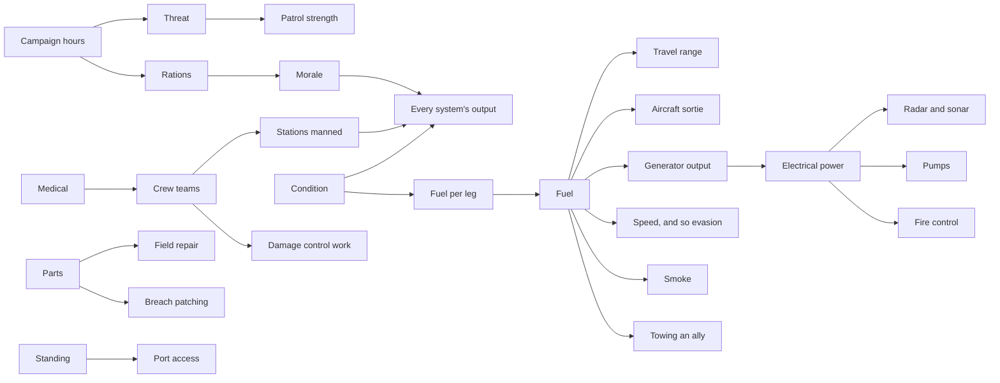

# Rules

**Version:** 0.1
**Date:** September 12, 2026
**Replaces:** `CONSEQUENCES.md`, and the wired option prose in `CATALOG-EVENTS.md`.

Consequences are **not authored**. Nobody writes "this closes an aircraft sortie" on an option. The engine holds one set of rules, every action spends into that model, and what the player can no longer do falls out of it automatically. Write the rule once and it is true in every situation forever, including the ones nobody thought of.

Every rule below has an ID. Content references rule IDs. Content never states an outcome the rules could compute.

## Period grounding

The ship is a 1939 to 1945 destroyer, and the rules have to be things that crew could actually do with what they actually had.

Three tiers of evidence, marked on every rule:

| Mark | Means |
|---|---|
| **[S…]** | Cited to a fetched source in `warships/`, under the repo's rules of evidence |
| **[period]** | Standard wartime practice, believed accurate, **not yet sourced**. Verify before shipping, or demote to [game]. |
| **[game]** | A deliberate abstraction chosen for play. Makes no claim about 1943. |

Nothing in this file claims to be historical unless it carries an `[S…]`.

### What the period forbids

Hard constraints. Any proposed mechanic that violates one is rejected without discussion.

- No helicopter, no powered air-sea rescue from the ship itself. Recovery is a boat, a line, a scramble net, or nothing. [period]
- No radar detects a submerged submarine. Radar is surface and air only. The design document already fixes this at [§1.7:193].
- No sonar works well at speed, and active sonar announces the searcher. [§1.12:361]
- No guided weapon unless that specific weapon had guidance. Depth charges are not guided. [§1.12:363]
- No instant repair. Field repair reaches 70% of system condition and no further [§1.9:283].
- No ship-to-ship voice chat across the ocean. Signalling is flag, light, flare, or radio, and radio is intercepted.
- No GPS. Position is dead reckoning corrected by star sights, and it drifts.
- No night vision beyond lookouts, starshell, searchlight, and radar.
- No crew resurrection, no teleporting between compartments. [§1.17:561]

---

## R1 · Resources

What feeds what. This graph is the reason R10 works: the engine can derive any consequence by walking it.



### R1.1 · One fuel pool [game]

Every fuel consumer draws from a single inventory: propulsion, generators, aircraft dispatch, smoke generation, and any tow given to another ship. There is no separate aviation fuel account for dispatch purposes [§1.12:374].

**Therefore:** fuel spent on anything is fuel unavailable for everything. The engine never needs to be told that turning the ship around costs you a sortie. It computes that when the sortie is requested and there is not enough.

### R1.2 · Damage raises consumption [S… partial, §6.5:1434]

`vessel_travel_fuel = distance × fuel_per_distance × speed_multiplier × weather_multiplier × damage_multiplier`

A damaged ship burns more to go the same distance. This is the loop that makes early damage expensive late.

### R1.3 · Speed costs fuel non-linearly [game, §2.12:953]

Economy 0.80 speed for 0.85 fuel. Cruise 1.00 for 1.00. Flank 1.25 speed for 1.60 fuel. Flank is nearly double cruise for a quarter more speed.

### R1.4 · Stocks, capacities and conditions are three different things [§1.10:319]

**Stocks** deplete: fuel, ammunition by class, torpedoes, depth charges, parts, medical, rations, flares, smoke. **Capacities** constrain: generator output, hangar room, cargo space, passenger slots, room occupancy. **Conditions** change: hull, system condition, team health, morale, stability. A rule that moves one never silently moves another.

### R1.5 · Nothing refills on a boundary [§1.10:327, §6.6:1536]

Crossing a sector, saving, loading, or leaving a screen restores nothing.

---

## R2 · Readiness, and the cost of being ready

This is the rule set the research actually supports, and it is better than anything invented.

### R2.1 · Two readiness conditions on a destroyer [S295 §22-8]

Readiness conditions govern **how many stations are manned**. Condition I is general quarters, battle stations fully manned. Condition II is war cruising. The Handbook of Damage Control states that many ships, destroyers and destroyer escorts among them, have only these two [S295, §22-8].

| Condition | Stations manned | Response to a new contact | Crew rest |
|---|---|---|---|
| **I, general quarters** | All | Immediate | None. Fatigue accrues. |
| **II, war cruising** | Reduced | Delayed by the time to go to stations | Watch below can rest |

### R2.2 · Readiness is not closure [S295 §22-9]

Readiness conditions pertain to personnel manning stations. Material conditions refer to states of closure. The handbook says explicitly that the two are not to be confused [S295, §22-9]. They are two separate player controls and they cost different things.

### R2.3 · Going to stations takes time [S292 para. 400]

War Instructions requires that the organisation permit the minimum shifting of personnel, with no loss of fighting power in the transition from a lower to a higher condition [S292, para. 400]. In the game: setting Condition I from Condition II runs a timer during which some stations are unmanned and crew are in transit. A contact detected during that transit is fought by a partly manned ship.

### R2.4 · Readiness has to be paid for in rest [S292 para. 400]

War Instructions lists provision for adequate rest among its basic considerations [S292, para. 400]. Holding Condition I accrues fatigue, which reduces the ship-wide output multiplier. The captain who runs at general quarters through a quiet sector arrives at the dangerous one with a tired crew.

### R2.5 · A reduced condition still fights, worse [S293 ch. 2]

Ordnance Pamphlet 1719 describes a stand-by condition in which targets are expected momentarily but no specific target is known, and requires the fire-control system to be ready both fully manned and in a reduced condition with fewer personnel [S293, ch. 2]. The Mark 37 director's full complement is six men; with Radar Equipment Mark 25 Mod 2 fitted it can stand by with one operator, the trainer [S293, ch. 2].

**Therefore:** a station at reduced manning produces reduced output, not zero. This is the `staffing_factor` at [§6.5:1456], and the research gives it a real shape: some equipment has a declared one-man mode, and the rest does not.

---

## R3 · Material condition of closure

### R3.1 · Two-condition ships close in two steps [S295 §22-10]

Ships are classified by how many progressive steps they pass through closing up for battle. Two-material-condition ships use Baker and Able; three-condition ships use X-ray, Yoke and Zebra, and the larger types are usually three-condition ships [S295, §22-9, §22-10]. Fittings are marked X, Y, Z and W.

| Condition | Fittings closed | Use |
|---|---|---|
| **Baker** | X and Y | Normal at sea and in port [S295, §22-9] |
| **Able** | X, Y and Z | Battle. Maximum resistance to damage consistent with operating the ship offensively [S295, §22-9] |

### R3.2 · Closing up slows your own crew [period]

Every closed fitting a team has to open and re-close adds to its travel time between compartments. Able is the safest condition and the slowest one to move through. This is the tradeoff and it is the whole point of having the control.

### R3.3 · Modified conditions exist to feed and relieve the crew [S295 §22-10]

A modified Zebra or Able is one in which certain doors, hatches, ventilation and flushing fittings are opened or operated to give relief or food to a crew held at battle stations for an abnormal length of time [S295, §22-10].

**Therefore:** a crew held at Condition I and Able indefinitely must either be relieved through a modified condition, which reopens flooding paths, or degrade. Circled Z fittings are never opened during general quarters without special authority from damage control [S295, §22-11].

### R3.4 · Closure limits the spread, it does not undo the water [§1.9:265]

Closing intact watertight boundaries contains flow. It does not remove water and it does not repair the breach.

---

## R4 · Ship handling

### R4.1 · The ship answers slowly [§1.11:339]

Heading, actual speed, ordered speed, and turn rate are separate values. Changing heading takes time, may expose a broadside, and may spoil a firing solution. Ships never teleport between range bands.

### R4.2 · Speed buys evasion, stopping forfeits it [game, §6.5:1473]

The target-manoeuvre term in the hit probability falls toward zero as own speed falls. A stopped ship is hit at the attacker's unmodified accuracy. This is why the rescue question is dangerous and not sentimental.

### R4.3 · A recovery turn returns the ship down her own track [period]

To come back to a position astern, the ship puts the wheel hard over, holds until roughly 60 degrees off the original heading, then shifts the rudder the other way and steadies on the reciprocal. It costs time, distance and fuel, and it puts the ship broadside to the sea partway through. Standardised recovery turns were worked out and taught during the war.

*Unsourced. Verify against a period seamanship manual before shipping, or demote to [game].*

### R4.4 · Sea state governs what the ship can do [game, §6.4:1413]

Sea state enters gunnery, torpedo accuracy, sonar performance, and boat work. Above a stated sea state, boat work is impossible regardless of anything else.

---

## R5 · Boats, recovery, and people in the water

The rule set behind man overboard, survivors, boarding, and prize crews. All of it, one model.

### R5.1 · Recovery needs a boat, and a boat needs davits [S186]

A destroyer recovers a person or a party by sea boat, by line, or by scramble net. The Iowa main-deck plan lists a `man overboard davit P/S` at frames 63 to 72, alongside life rafts and a 33-foot personnel boat [S186]. A destroyer carries less, but the principle is the same: recovery is a named piece of equipment in a named place, and damage to that place removes the capability.

### R5.2 · Marking the position comes first [period]

A lifebuoy goes over the side immediately, with a calcium flare or smoke float to mark where. Lookouts are told to keep the man in sight and not look away. The marked position drifts with wind and current from the moment it is made.

**Therefore:** the position is an estimate that decays with time, exactly like a sonar contact at [§1.11:341]. Delay does not merely cost hours. It widens the search area.

*Unsourced. Verify before shipping.*

### R5.3 · Lowering a boat costs a slowed ship and a detached crew [period]

The ship must be slowed or stopped. The boat's crew leaves the ship's own roster for the duration, so their station is unmanned under R2.5. Recovery of the boat costs the same again.

### R5.4 · The same rule covers every recovery [game]

Man overboard, survivors on a raft, a boarding party, a prize crew and a salvage party are one mechanic with different durations and risks. Build it once.

### R5.5 · Doctrine can forbid it [period]

An escort on convoy duty may be under orders not to stop. A stopped escort in a submarine area is a target and leaves a gap in the screen. Rescue ships were attached to convoys so escorts would not have to stop.

**Therefore:** the decision is often not "rescue or not". It is "am I permitted to, is the sea state workable, and what is the screen doing while I am stopped". Disobeying a standing order is a decision with the command under R8, not a mechanical penalty invented for the occasion.

*Unsourced. Verify before shipping.*

---

## R6 · Detection and emissions

### R6.1 · Contacts ripen through states [§1.11:341]

`unobserved → suspected → detected → classified → tracked`. Quality decays when observation stops. A last-known marker is not a current position.

### R6.2 · Every sensor has eligible targets and nothing else [§1.11:343]

Eligibility precedes accuracy. Radar does not see a submerged submarine. Sonar does not see an aircraft. Accuracy cannot repair ineligibility.

### R6.3 · Searching actively announces you [§1.15:500]

Active radar can be noticed by an eligible opposing receiver. Active sonar creates an acoustic cue. A transmission can hand an enemy a bearing [§1.15:503]. A flare is visible to everyone, not only to the intended friend.

### R6.4 · Own speed degrades own sonar [§1.12:361]

Going fast to get somewhere means hearing less on the way.

---

## R7 · Damage control

### R7.1 · Damage runs in four independent layers [§1.9:254]

Structural hull, local compartment and system condition, hazards (fire, breach, water, smoke), and stability and buoyancy. A ship with hull remaining can still founder at 80% flooding [§1.9:269] or capsize below 10 stability [§6.3:1389].

### R7.2 · Work is done by teams in rooms, and rooms are small [§1.8:220]

Three team tokens per room, producing 1.0, 1.6 then 2.0 units of work. Anyone can fight a fire. Reinforcing a fire always means leaving something else unmanned.

### R7.3 · Hazards damage the people fighting them [§1.8:224]

Fire, smoke and rising water damage a team's shared health while it works. Auto-pause at 25%, optional withdrawal at 20%, lost at zero, permanently for the run.

### R7.4 · Material repair needs material [§6.5:1505]

Parts cap what can be repaired. Containment without parts is possible; restoration is not.

---

## R8 · Orders, doctrine, and standing

### R8.1 · The player is under orders [period]

A destroyer is not a free agent. It has a station, a screen position, a convoy speed, and orders about what it may stop for, what it may transmit, and when it may open fire.

### R8.2 · Breaking an order is a decision with the command, not a fine [game]

Disobedience changes standing with the issuing authority, which changes port access, service tiers and offers under [§6.2:1372]. It never applies an invented mechanical penalty to the ship.

### R8.3 · Identification is a real problem [period]

Neutral shipping existed, and mistakes were made in both directions. A rule that requires identification before firing creates a genuine hesitation cost at night and in fog, and it is period-correct rather than a contrivance.

---

## R9 · Time, watches, and endurance

### R9.1 · Time only moves when the player commits [§1.4:102]

Reading the map, planning, and opening a menu cost nothing. Committing travel, a repair, a service, or an event action advances the stated hours.

### R9.2 · Hours feed threat and burn rations [§6.5:1443, §1.10:321]

Threat rises 2 points an hour. Rations burn one unit per active team per campaign day, plus whatever rescued groups declare.

### R9.3 · Shortage accumulates and does not reset [§1.10:323]

A ship-wide shortage duration builds and applies a capped morale and recovery penalty. Reloading, changing sectors, or toggling the ration policy does not clear it.

### R9.4 · Morale multiplies everything [§6.5:1463]

One ship-wide value, bounded 0.85 to 1.10, applied to every system's output. There are no individual morale, fatigue or meal meters [§1.8:246].

---

## R10 · How consequences are produced

The architectural rule. This is the one that replaces authored consequence text.

### R10.1 · An action declares only what it spends [game]

```yaml
option:
  id: turn_and_search
  requires: {}
  spend: {fuel: 3, campaign_hours: 1}
  detach: {teams: 0}
  speed_order: slow
  outcome_roll: recovery_chance
```

No `closes` field. No prose about aircraft. The option does not know what else the ship wanted to do with that fuel, and it should not have to.

### R10.2 · The engine computes what is now impossible [game]

At every point where the player could act, the engine evaluates each available action against current state and marks the unaffordable ones with the reason. "Launch strike: insufficient fuel, needs 12, have 7." That sentence is the consequence, and it was never written by hand.

### R10.3 · The preview shows the spend and the projected remainder [§1.16:536]

Before committing: the cost, the known risk, and what the stock will be afterward. Not the full downstream chain, which is unreadable. The resource and the number.

### R10.4 · The debrief reconstructs the chain [§4.6:1238]

The cause-and-effect timeline is generated by walking the log, not by reading authored strings. The design document's own example: heavy volley, generator lost, pump output fell, teams left the guns to patch flooding, ammunition remained but offensive uptime collapsed.

### R10.5 · No refunds, no compensating rewards [§1.16:538]

A cost is spent when spent. The interface does not return it because the outcome was bad, the target escaped, or the battle ended. A bad result is a legitimate result and is not padded with a consolation prize.

### R10.6 · Every consequence has a recovery path, and it costs [§2.12:999]

Cheaper stabilisation instead of full restoration, a finite repair opportunity, a lower-risk route, selling surplus. None free, none a reset.

---

## R12 · Hunting a submarine

The design document specifies depth states, finite torpedoes and battery, and that
depth charges are not guided [§1.12:358]. What follows is the procedure that makes a
hunt a problem rather than a dice roll. Nearly all of it is `[period]` and unsourced.

### R12.1 · Sonar is a searchlight, not a floodlight [period]

The set trains a narrow beam and listens for its own echo. The operator sweeps it
across an arc, and the ship hears only where the beam is pointing. Coverage is a
choice, and a wide sweep updates any one bearing slowly. This is the same broad
versus focused decision the design document already gives radar at [§1.18:584].

### R12.2 · Speed is the price of hearing [§1.12:361]

Own-ship noise and flow over the dome degrade the set as speed rises. Above a stated
speed the search is worthless. Getting there fast and hearing anything are opposed,
and the player has to keep choosing between them.

### R12.3 · Passive first; going active tells the boat exactly where you are [S21, S17, §1.15:505]

Passive listening is free and vague. The one sourced case in the repo: Prinz Eugen's
hydrophone arrays picked up propeller noise from two ships before any radar echo, at
about 0530 on 24 May 1941 [S21], and later reported torpedo noise that caused both
German ships to turn away [S17]. Passive gives a bearing and a classification, not a
range.

Active gives range and bearing, and announces the hunter. A submarine that hears
pinging knows it has been found, how close you are, and when to turn.

### R12.4 · The layer [period]

A temperature gradient bends sound and puts a shadow below it. A boat that gets under
the layer is much harder to hold. Whether a layer is present is a property of the
water, not of the submarine, and a ship fitted to measure it knows before the hunt
starts instead of guessing afterwards.

**Therefore:** depth is a hiding place, not only a damage-avoidance number. A hunt in
layered water is a different problem from a hunt in mixed water, using identical
equipment on both sides.

### R12.5 · Dead time, the problem the whole hunt turns on [period]

Depth charges roll off the stern and fire from throwers abeam. The ship must pass over
the target to deliver them. As it closes, the submarine passes into the sonar's blind
cone beneath the ship and contact is lost before the charges go.

So the attack is aimed at an **extrapolated** position, not an observed one. The gap
between the last good bearing and the drop is exactly when a competent submarine
turns, changes depth, and is no longer where the plot says.

This is the mechanic. Everything else in R12 is context for it.

### R12.6 · Ahead-throwing weapons trade certainty for forgiveness [period]

A forward-throwing mortar fires while contact is still held, which removes dead time.
The charges are contact-fused: they explode only on a hit. A miss produces nothing at
all, no damage and no disturbance.

| | Stern depth charges | Ahead-throwing pattern |
|---|---|---|
| Contact at the moment of release | Lost | Held |
| A near miss | Still damages | Does nothing |
| After a miss | Water churned, sonar degraded (R12.9) | Water quiet, contact retained |
| Feels like | A heavy swing in the dark | A precise shot that usually misses |

Neither is strictly better, which is why both belong in the game and why an equipment
choice between them is a real build decision rather than a tier upgrade.

### R12.7 · Depth is a guess [period]

The charges are set to a depth before release. Early sets gave range and bearing and
no depth at all. Set them shallow against a deep boat and the pattern goes off above
it harmlessly. The player is choosing a volume to attack, with incomplete information
about one of its three dimensions.

### R12.8 · A pattern covers a volume [period]

Charges dropped from the stern and thrown from both beams make a three-dimensional
box. A wider pattern covers more water with less lethality per point. Stock is finite
and the choice of pattern spends it faster.

### R12.9 · Your own explosions blind you [period]

Detonations churn the water and leave a mass of disturbed water that the set returns
echoes from. After an attack the hunter's own sonar is degraded for a period, which is
precisely when the submarine is moving. A miss is not neutral. It costs you the
contact you had.

### R12.10 · The boat has counters, and they are not magic [period]

A hard turn leaves a knuckle of disturbed water that returns a sonar echo resembling a
contact. Bubble decoys were carried by German boats to produce the same effect
deliberately. Both are false contacts the player has to resolve by observation over
time, which is the association decision the design document already describes for
radar at [§1.18:586].

### R12.11 · Hold-down is a way to win without hitting anything [§1.12:358]

A submerged boat runs on battery and breathes what it has. Staying submerged and
manoeuvring drains both. A hunter who simply refuses to leave can force the boat to
surface or to accept damage, and this costs the hunter hours, fuel, and everything
those hours cost under R9.2.

This is the alternative victory condition, and it should be a real one, because it is
what actually happened.

### R12.12 · Two ships are worth far more than twice one [period]

One ship holds contact and directs while the other attacks, so the attacker's dead
time is covered by the observer. A lone destroyer attacking alone is fighting the
problem in R12.5 with nothing to fix it.

**Therefore:** an escort is worth more against a submarine than its guns suggest, and
detaching your escort for something else has a cost that shows up here.

### R12.13 · You usually do not know whether you killed it [period]

Oil on the surface, debris, and air can mean a kill, a damaged boat running, or a
deliberate discharge to look like one. Wartime claims were frequently wrong.

**Therefore:** the encounter should often resolve as "contact lost, evidence
ambiguous" rather than a confirmed kill, and the debrief can say so honestly. A
submarine that got away is a pursuit flag under [§1.12:365], not a rematch spawner.

### R12.14 · No ASW capability is never a dead end [§1.12:364]

A ship without depth charges can evade, screen what it is protecting, request eligible
support, or satisfy a survival objective. Mandatory progression never requires sinking
a deep submarine with no reachable counter.

### R12.15 · The submarine decides too [§1.13:420]

It uses its own observations and doctrine, not your hidden state. It attacks when it
has a solution, goes deep when it is found, breaks off when its threshold is reached,
and leaves. It has finite torpedoes, and spending them is a decision it can regret.

---

## R13 · Air attack

The most common way a destroyer died. Each kind of aircraft is a different problem
and needs different answers, which is what makes an air raid more than an incoming
damage number.

### R13.1 · Anti-aircraft fire is layered, in three bands [S89 p. 150, S95]

The heavy dual-purpose battery engages at range with time or proximity fuzes. A medium
automatic band takes over as they close. A close-in band is the last chance, and it is
firing at something already committed to its attack run.

The evolution is sourced. Designed 1.1-inch quad mounts and 0.50-inch machine guns were
replaced during building by 40 mm Bofors and 20 mm Oerlikons [S95]. The 1944 text
confirms 1.1-inch quads on the larger ships gave way to 40 mm twin and quad mounts, and
that the 20 mm had almost entirely replaced the 0.50-calibre gun [S89, p. 150]. Iowa as
commissioned in February 1943 carried fifteen quad 40 mm, sixty barrels, and sixty
single 20 mm [S95].

**Therefore:** an aircraft crosses three separate weapon envelopes on its way in, each
with its own ammunition, its own crews and its own arcs. Losing one band leaves a hole
at a specific range rather than a general penalty.

### R13.2 · The proximity fuze is a real, dated step change [S91]

Proximity-fuzed AA VT rounds came into use from late 1942, and by mid-1944 most
front-line ships carried about three VT rounds for every time-fuzed AA Common round and
fired them in that ratio [S91].

**Therefore:** VT is a purchasable ammunition type, not a stat. Buying it changes heavy
AA effectiveness sharply and costs more per round, so the player chooses how much of the
magazine is VT. A ship that spent its VT early meets the next raid on time fuzes.

### R13.3 · Four attack profiles, four different answers [period]

| Profile | How it attacks | What kills it | What the ship does |
|---|---|---|---|
| **Torpedo bomber** | Must descend, slow, and fly straight and level on the run-in to drop | The run-in. It is predictable and in range of everything | Turn to comb the tracks, present the narrowest target, use speed |
| **Dive bomber** | Steep dive from height, releases close, accurate | Heavy AA on the push-over, close-in guns in the dive | Hard turn under the dive; the bomber has to follow you down |
| **Level bomber** | High, straight, releases a pattern | Heavy AA only. Often unreachable | Keep turning. Historically they rarely hit a manoeuvring ship |
| **Fighter strafe** | Low pass with guns | Close-in AA | Little. It hurts exposed crew and light mounts, not the hull |

The point is that no single answer works against all four. A ship optimised for close-in
fire is nearly helpless against level bombing; a ship with only heavy AA is overrun by
anything that gets inside it.

### R13.4 · A near miss is not a miss [S28 p. 176, S26 p. 407]

The first bomb to hit Roma on 9 September 1943 passed through the ship and out of the
hull, exploding in the water beneath and causing serious damage [S28, p. 176; S26, p.
407]. Italia was hit by one of the same bombs and took several hundred tonnes of sea
water [S13, note 19].

**Therefore:** bombs that do not land square still spring plates, start flooding and
shock machinery. An air attack that "missed" can still put a ship into damage control.

### R13.5 · Guided bombs exist from 1943 and have a visible weakness [S13, S28, S26]

Eight aircraft of III/KG 100, flying from Istres, attacked with FX 1400 radio-controlled
bombs and hit Roma with two; she capsized at 1612 with heavy loss [S13]. A second bomb
exploded in her forward main-battery magazines and blew number 2 turret clear of the
ship [R5].

The weakness is the guidance. The launching aircraft has to hold course and keep the
weapon in sight to steer it.

**Therefore:** the counter is to make that aircraft break off, by AA or by manoeuvre that
spoils the geometry, and the design should let the player see that the bomber is
committed rather than merely watching a projectile.

### R13.6 · The aircraft that finds you is more dangerous than the ones that attack [period]

A shadower orbiting at the edge of range does no damage and decides everything. It
reports your position, course and speed, and the strike that follows arrives knowing all
three. Driving it off or breaking contact is worth more than shooting down a bomber.

This is already EVT-72 and R6.3. The rule generalises it.

### R13.7 · Aircraft have a radius, and outside it you are safe [period]

Land-based air reaches only so far. Carrier air reaches only so far from its carrier.
A route can be planned around air cover, and the gap between two air umbrellas is a real
place on the map, which is a strategic decision rather than a combat one.

### R13.8 · Weather and darkness suppress air attack [period, §1.12:384]

Low cloud, heavy sea and night sharply reduce what aircraft can do, until late-war
radar-equipped aircraft. Foul weather is shelter. The design document already caps this:
weather may reduce sortie performance, and a mandatory boss cannot invalidate an
aviation build for a whole fight without a fallback [§1.12:384].

### R13.9 · Anti-aircraft ammunition burns faster than anything else [§1.10:294]

Sustained close-range fire empties magazines quickly, and at zero that battery cannot
fire at all. Fire discipline, choosing which band engages and when, is the actual skill.

### R13.10 · A suicide attack breaks the AA arithmetic [period]

Ordinary AA works by making the attacker miss, break off, or die before release. Against
an aircraft whose weapon is itself, damaging it is not enough. Only destruction works,
and a burning aircraft still arrives. If the late-war period is in scope this is a
separate rule, not a damage multiplier.

### R13.11 · Manoeuvre is a defence and it costs fuel [§6.5:1473, R1.3]

Speed and turning enter the hit calculation directly through the target-manoeuvre term.
Evading air attack is done at high speed, which burns 1.60 fuel per distance under R1.3.
A day of air attacks is paid for in range.

---

## R14 · Carriers

### R14.1 · You do not fight the carrier. You fight its air group [period]

A fleet carrier engages from beyond the horizon and never appears on the player's chart
as a target. What arrives is aircraft. Treating a carrier as a surface opponent with a
health bar would be the single most ahistorical thing in the game.

**Therefore:** a carrier is modelled as an off-map source that generates strikes, with a
bearing that can be estimated from the direction aircraft arrive and depart.

### R14.2 · The air group is finite, so shooting aircraft down is progress [period]

A carrier embarks a fixed number of aircraft and replacing them at sea is not possible.
Every aircraft destroyed is permanently gone from the source. A player who survives three
strikes has measurably weakened an enemy it never saw.

This gives an air battle a win condition other than survival, without inventing one.

### R14.3 · The escort carrier is the one you can actually attack [period]

Escort and light carriers were slow, lightly built and thinly protected. A destroyer that
gets within gun or torpedo range of one has a real chance, which is exactly why they
travelled with a screen. This is the carrier that belongs in a surface encounter; the
fleet carrier is not.

### R14.4 · The screen is the obstacle, not the carrier [period]

Reaching any carrier means getting through what is escorting it. A lone destroyer
attacking a fleet carrier's screen is choosing to die, and the game should present that
clearly rather than dressing it as a fight worth taking.

### R14.5 · Carrier aircraft sank capital ships, including in harbour [R3, R1]

Conte di Cavour was sunk in shallow water at Taranto by an air-dropped torpedo on 12
November 1940 [R3]. Littorio was hit by three torpedoes in the same raid and was under
repair until April 1941 [R1]. Vittorio Veneto was torpedoed by aircraft at Matapan and
under repair to August 1941 [R1].

**Therefore:** an anchorage is not safe, and a mission that puts the player in one
during a carrier raid is period-correct.

### R14.6 · Finding a carrier is a mission, not an encounter [period]

Locating the source of the strikes is a scouting objective under [§1.13:409], and what
the player does with the position is report it, not attack it. Reporting it to a force
that can act is a legitimate and period-correct victory.

---

## R11 · Faction missions

One tasking per navy, offered on some runs and not others. The rules that keep it
from breaking faction parity or the baseline route.

### R11.1 · One per run at most, rolled at run generation [game]

The roll happens at creation, alongside the rest of the map, not mid-run. Proposed
rate: **one run in three**. Rolling at generation lets the validator at [§5.2:1267]
check the route with the mission in place, so a mission can never make a run
unwinnable. The player is not told at setup; the tasking arrives as a signal later.

### R11.2 · It is offered, never assigned [§5.3:1281]

Nothing the mission pays may be required to reach or beat the boss. A run that
declines every mission must remain a complete run. The generator's feasibility
check ignores mission rewards entirely.

### R11.3 · It runs as a sortie, not as route progress [§1.5:139]

The mission departs from a staging node and returns to it. It consumes time, fuel
and risk, and resolves once. The main graph still moves forward as normal, so the
run does not get longer, it gets more expensive. That expense is the cost of
accepting.

### R11.4 · Equal value, unequal procedure [§1.1:41]

The four missions pay within the same band and demand the same order of resources.
They differ in **which** system they tax and **which** resource they pay in. If one
navy's mission is measurably better, that is a faction bonus by the back door and
the design document forbids it.

| Navy | The system it taxes | What it pays in |
|---|---|---|
| American | Sonar patience, depth-charge stock, time on contact | Intelligence and standing |
| British | AA ammunition, screening discipline, keeping others alive | Material and standing |
| German | Emissions discipline, navigation accuracy, deck space | Scrap and route intelligence |
| Japanese | Fuel at high speed, a hard deadline, cargo that must arrive | Material and standing |

### R11.5 · Bounded to three nodes, resolved inside its sector [§5.4:1300]

A mission occupies at most three nodes of sortie and must finish in the sector it
started in. If it cannot, it resolves through its declared alternative and is marked
unresolved in the debrief.

### R11.6 · Declining costs standing and nothing else [R8.2]

Refusing a tasking changes standing with the issuing authority, which moves port
access and service tiers under [§6.2:1372]. It applies no mechanical penalty to the
ship, and the mission does not re-offer in that run.

### R11.7 · Failure is survivable, and partial success pays partially [§1.13:417]

Every mission declares victory, withdrawal, partial success and local failure, like
any other encounter. Local failure never ends the campaign. A Tokyo Express run that
lands half its drums delivered half of them.

### R11.8 · The reward is horizontal [§2.7:740]

Standing, material within the normal band, and **one unlock predicate** that makes a
between-run alternative available. No permanent numeric bonus, because the design
document excludes those from the default design. Completing a navy's mission is how
that navy's extra hull or doctrine unlocks.

### R11.9 · Novelty across runs [§6.5:1513]

The novelty factor reads profile history. A mission completed recently is weighted
down, so a player who runs the same navy repeatedly does not meet the same tasking
every time it fires.

### R11.10 · Period-correct or cut [R0]

Each mission is a thing that navy actually did with destroyers. All four are marked
`[period]` and unsourced. They go in the sourcing queue with the other eleven.

---

## How content uses this

A situation says what happened and which rules engage. It does not say what the outcome is.

**Man overboard, as content:**

```yaml
situation:
  id: man_overboard
  trigger: {speed: high, event: turn_or_weather}
  engages: [R5.1, R5.2, R5.3, R5.5, R4.2, R4.3, R2.1]
  marks_position: true          # R5.2, drifts from this tick
  options:
    - {id: recovery_turn, speed_order: slow, spend: {campaign_hours: 1}}
    - {id: lower_boat, requires: {boat: serviceable, sea_state: below_heavy},
       detach: {teams: 1}, speed_order: stop}
    - {id: press_on, spend: {morale: 6}, flags_set: [left_a_man]}
```

Everything else is computed. Whether the boat can be lowered comes from R4.4 and the current sea state. Whether stopping is permitted comes from R5.5 and current orders. What stopping costs comes from R4.2. What the fuel spent closes comes from R1.1 when the player next tries to do something with fuel. How far the man has drifted comes from R5.2 and elapsed time.

The author writes nine lines. The rules do the rest, and they do it the same way every time.

---

## What needs sourcing before this ships

Eleven rules, four missions and most of R12, R13 and R14 carry `[period]`. They are believed accurate and are not yet cited, which by this repo's standard means they are not yet facts.

| Rule | Claim to verify |
|---|---|
| R3.2 | That closed fittings measurably slowed crew movement, and by roughly how much |
| R4.3 | Recovery turn procedure and when it was standardised |
| R5.2 | Lifebuoy, calcium flare or smoke float, and the lookout order |
| R5.3 | Time to lower and recover a sea boat on a destroyer, and the sea state limit |
| R5.5 | Escort orders regarding stopping for survivors, and convoy rescue ships |
| R8.1 | The standing orders a destroyer actually operated under |
| R8.3 | Identification procedure and the rules of engagement for neutral shipping |
| MSN-01 | US hunter-killer group practice, and a destroyer's part in it |
| MSN-02 | Besieged-island supply runs, the escort's orders and the air threat |
| MSN-03 | German destroyer offensive minelaying, and what mine rails displaced |
| MSN-04 | Night high-speed resupply runs, alongside unloading versus floating drums off |
| R12.1, R12.2 | Sonar beam width, sweep rate, and the speed at which a set stops working |
| R12.4 | Thermal layers, shadow zones, and what was fitted to detect them |
| R12.5 | Dead time: the blind cone, and how long contact was actually lost on a run-in |
| R12.6, R12.7 | Ahead-throwing weapons, contact fusing, and depth setting practice |
| R12.8, R12.9 | Pattern shapes, and how long own detonations degraded own sonar |
| R12.10 | Knuckles and bubble decoys, and how they read on a set |
| R12.12 | Two-ship attack procedure, one holding contact while the other runs in |
| R12.13 | What counted as evidence of a kill, and how often claims were wrong |
| R13.3 | Attack profiles: run-in speeds and heights, and why level bombing missed ships |
| R13.6 | Shadower practice, and how a strike was vectored onto a reported contact |
| R13.7 | Land-based and carrier air combat radii, and the size of the gaps between them |
| R13.8 | Weather and night limits on air attack, and when radar-equipped aircraft changed them |
| R13.10 | Whether the late-war suicide-attack period is in scope at all |
| R14.1, R14.2 | Carrier air group sizes, and replacement at sea |
| R14.3, R14.4 | Escort carrier protection and speed, and typical screen composition |

`skills/ww2-warship-research/SKILL.md` is the procedure. Each of these is a research task that ends in an `[S…]` or a demotion to `[game]`.

---

*Rules marked `[S…]` cite fetched sources in `warships/`. Rules marked `[§x:NNN]` cite the design document. Rules marked `[period]` are unverified and listed above. Rules marked `[game]` make no historical claim.*
