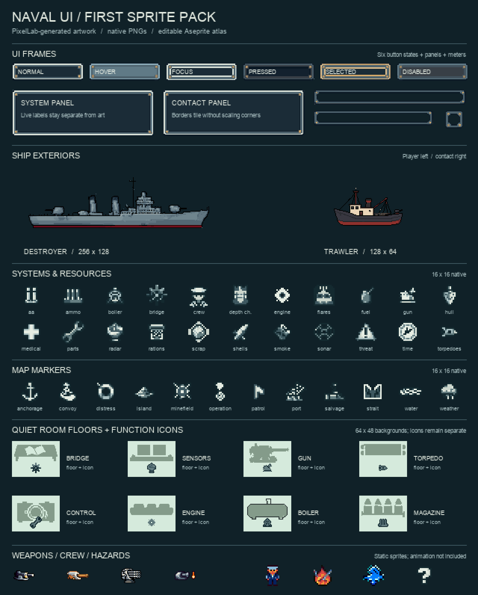

# Naval UI v1 — first asset set

The first static art pack for the WWII destroyer roguelite: **72 selected PNG assets**, generated through PixelLab MCP and inspected at native size and 4× zoom. These are art candidates for integration; the current game renderer does not load them yet.



## Files to use

- [Individual PNGs](assets/) and [manifest](manifest.json): stable IDs, native sizes, hashes, atlas rectangles, pivots, and provenance.
- [Editable Aseprite source](naval-ui-assets-v1.aseprite): 72 named layers, one per selected sprite.
- [Atlas PNG](naval-ui-assets-v1-export-check.png) and [atlas layout](naval-ui-assets-v1-atlas-layout.json): 1024×1024, native pixels, 4px gutters.
- [Offline catalog](review.html): download and open locally for searchable 1× and 4× previews. GitHub displays its source instead of running it.
- [Generation provenance and prompts](provenance.json) and [credits](CREDITS.md).

| Family | Count | Native size |
|---|---:|---:|
| Reusable UI frame templates | 12 | 17×17 |
| System and resource icons | 22 | 16×16 |
| Map markers | 12 | 16×16 |
| Weapon icons | 4 | 32×32 |
| Room backgrounds | 8 | 64×48 |
| Dark room function icons | 8 | 16×16 |
| Crew token, fire, flood, unknown contact | 4 | 16×16 |
| Destroyer exterior | 1 | 256×128 |
| Trawler exterior | 1 | 128×64 |

The twelve UI templates comprise six button states, three panels, two meters, and an icon socket. The original twelve larger [UI crops](assets/ui/) and [generation sheet](raw/ui_frames.png) are supplementary sources, excluded from the 72-asset count and the primary atlas.

## Integration notes

Keep the player ship on the left, the enemy on the right, and the bottom controls in one visible screen. The overview above is an asset catalog, not a gameplay layout.

- Draw at native size or an integer multiple using nearest-neighbor sampling and integer positions. For Canvas 2D, disable `imageSmoothingEnabled` before drawing sprites. Do not enlarge a source and call the result a higher-detail master.
- Keep labels, counters, meter fills, selection logic, room occupancy, and damage state separate from the artwork.
- Use light HUD glyphs on dark panels and the `room_icon_*` variants on pale room floors. Backgrounds and function icons are independent layers.
- Eight backgrounds can support ten proposed compartments by reusing the gun and magazine floors fore and aft. Fit them deliberately to the eventual geometry; do not stretch a 64×48 floor into an incompatible room.
- UI borders use fixed 8px corners with repeatable 1px edge/center strips. Tile them according to [ui-nine-slice.json](ui-nine-slice.json). The 17×17 template is a construction source, not the intended size of every control. See the [assembled size proof](qa/ui-nine-slice/proof-native.png).

The destroyer is a **closed-hull exterior**, not a playable ten-room cutaway. Animation, exact compartment geometry, full fleet coverage, and game integration remain future work. The boiler background has a stronger outline than the other room backgrounds, and the torpedo background has weak tube separation; explicit function icons carry room identity. The ships are schematic game artwork, not historically validated class drawings.

## Validation and optional tools

All **72** exported Aseprite regions match their source PNG RGBA pixels exactly. The selected sprites have no partial-alpha pixels or isolated alpha components of four pixels or fewer. UI seams were visually inspected at native and 4× sizes. See [export comparison](qa/source-export-comparison.json), [pixel summary](qa/pixel-summary.json), [room review board](qa/rooms-v3-final-4x.png), and [dark-icon contrast proof](qa/room-icon-contrast.png). These checks verify file integrity and observed artwork quality; they do not validate gameplay fit.

The PNGs and offline catalog need no tools installed. Optional helpers use Python 3.10+; assembly and verification also require Pillow. Rebuilding the layered source requires Aseprite with Lua scripting support. Run these commands from this pack's directory:

```sh
python3 scripts/build_review.py
python3 scripts/verify_atlas.py
python3 scripts/assemble_ui.py button_normal 96 24 /tmp/naval-button.png
aseprite -b --script-param root="$PWD" --script scripts/import_manifest.lua
```

The import script preserves native pixels and uses the manifest's atlas positions. Re-run verification after editing or rebuilding an atlas. The manifest and provenance use relative paths and stable job identifiers; account logs, temporary download links, rejected generation candidates, and local workspace paths are not part of this repository pack.
